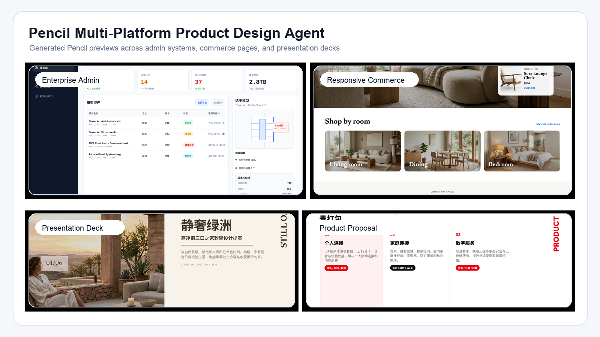
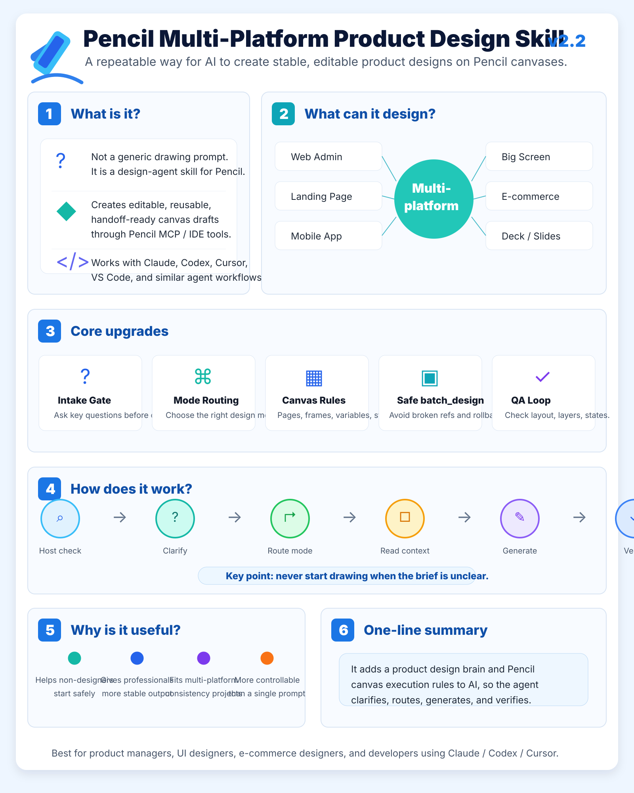
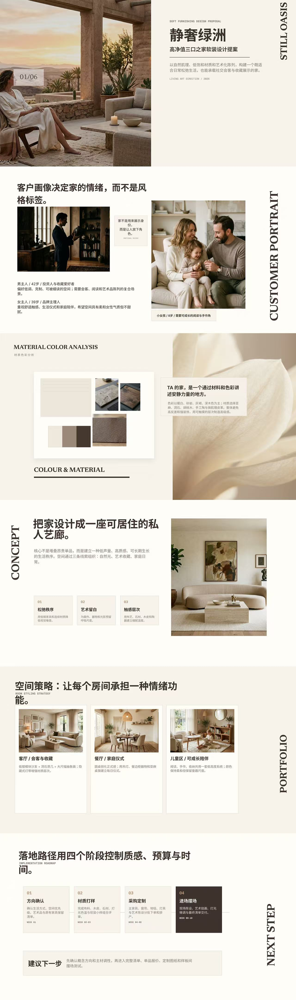
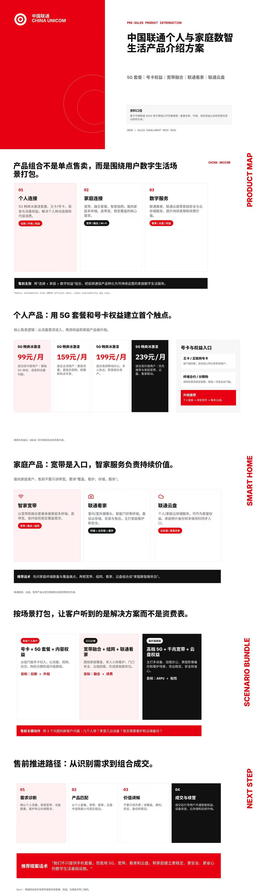

# Pencil Multi-Platform Product Design Agent Skill

Structured Pencil MCP design workflows for real product screens, dashboards, decks, and multi-platform systems.



An unofficial, community-maintained Agent Skill for turning AI assistants into structured multi-platform product design agents for Pencil MCP / Pencil IDE extension workflows.

It helps AI agents create, modify, review, and verify editable Pencil canvas designs across Web Admin, SaaS Dashboard, responsive web, Mobile App, WeChat Mini Program, data visualization big screen, e-commerce/campaign, design system, presentation/HTML deck, and cross-platform consistency scenarios.

> This is an independent community project. It is not affiliated with Pencil, Anthropic, OpenAI, Cursor, GitHub, or any related company.

## Overview



## Example work

These collages show complete Pencil-generated proposal work, not isolated UI fragments.





## Quick Start

1. Copy this repository into the skills directory used by your agent environment.
2. Make sure the skill folder contains `SKILL.md` and `references/`.
3. Ask your agent to use the Pencil multi-platform product design agent skill.
4. Replace `assets/preview.png` with your own preview image before publishing.

```text
Use the Pencil multi-platform product design agent skill.

I need you to design a Pencil canvas for:
[task]

If my request is incomplete, first run the Clarification / Intake Gate.
```

## Supported modes

- Enterprise Admin / SaaS Dashboard
- Responsive Web / Landing Page
- Mobile App
- WeChat Mini Program
- Data Visualization Big Screen
- E-commerce / Campaign
- Design System / Component Library
- Presentation / HTML Deck
- Cross-platform Consistency

## Preview gallery

- [Enterprise admin preview](assets/gallery/web-admin-bimops.png)
- [Responsive e-commerce preview](assets/gallery/responsive-ecommerce-home.png)
- [Presentation deck cover](assets/gallery/deck-cover-still-oasis.png)
- [Product proposal deck preview](assets/gallery/deck-product-map.png)
- [Complete sample Pencil file folder](examples/sample-pencil-file/)

## Why this exists

AI can generate UI quickly, but design work often fails when the agent starts drawing before understanding the goal, guesses the wrong platform, ignores the current `.pen` file, creates hard-to-edit canvas elements, misses states, or uses unsafe `batch_design` references.

This skill adds a structured workflow:

```text
Host check
→ Clarification / Intake Gate
→ Inspect current Pencil state
→ Mode routing
→ Context reading
→ Direction proposal
→ Pencil canvas generation
→ Verification
```

## What this skill includes

- Clarification / Intake Gate for incomplete prompts.
- Mode Router for selecting role and platform modes.
- Role modes: Beginner, Designer, Product Manager, E-commerce Designer, Developer/Handoff.
- Platform modes: Enterprise Admin, Responsive Web, Mobile App, WeChat Mini Program, Big Screen, E-commerce, Design System, Cross-platform Consistency, Presentation/Deck.
- Pencil MCP canvas rules for Pages, Frames, Layers, Components, Variables, and States.
- Safe `batch_design` rules.
- Codebase sync rules for VS Code / Claude Code / Codex / Cursor workflows.
- Quality verification and failure-handling rules.

## Repository structure

```text
.
├── assets/
├── examples/
├── SKILL.md
├── references/
├── templates/
├── standalone/
├── docs/
├── README.zh-CN.md
├── LICENSE
├── CHANGELOG.md
└── CONTRIBUTING.md
```

## Installation

Copy this repository folder into the skills directory used by your agent environment. The folder must contain `SKILL.md` and `references/`.

If your tool does not support skills, use:

```text
standalone/Pencil_MultiPlatform_Product_Design_Agent_SingleFile.md
```

## Minimal usage prompt

```text
Use the Pencil multi-platform product design agent skill.

I need you to design a Pencil canvas for:
[task]

If my request is incomplete, first run the Clarification / Intake Gate.
Then route the task to the right role/platform mode, inspect the current .pen file, propose directions, create the canvas through Pencil MCP or Pencil extension tools, and verify the result.
```

## License

MIT License. See [LICENSE](./LICENSE).

## Disclaimer

This repository does not contain proprietary system prompts, leaked prompts, private product materials, or third-party copyrighted design assets.
