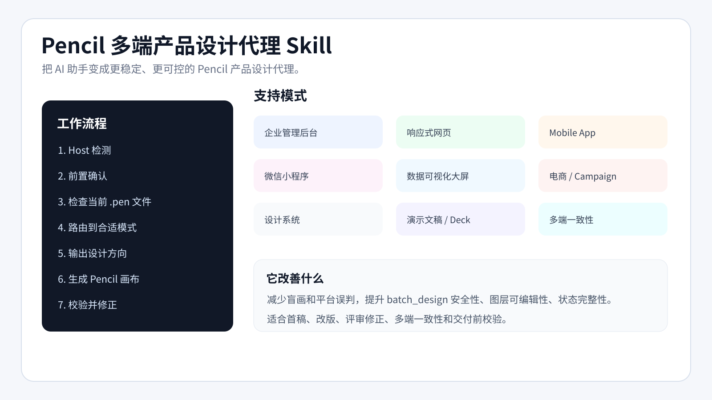

# Pencil 多端产品设计代理 Skill

面向真实产品界面、管理后台、大屏、演示文稿和多端系统的结构化 Pencil MCP 设计工作流。


一个面向 Pencil MCP / Pencil IDE 插件工作流的开源 Agent Skill，用于让 AI 助手更稳定地完成多端产品设计。

支持：Web 管理后台、SaaS Dashboard、响应式网页、Mobile App、微信小程序、可视化大屏、电商页面、设计系统、PPT/HTML 演示文稿和多端一致性方案。

> 本项目是非官方社区项目，与 Pencil、Anthropic、OpenAI、Cursor、GitHub 等公司无官方关联。

## 概览



## 示例作品

下面是完整 Pencil 生成作品拼图，不只是单张 UI 截图。


## 快速开始

1. 将本仓库复制到你的 Agent 支持的 skills 目录中。
2. 确保 Skill 目录中包含 `SKILL.md` 和 `references/`。
3. 在提示词中要求 Agent 使用 Pencil multi-platform product design agent skill。
4. 发布前请将 `assets/preview.png` 替换为你自己的预览图。

```text
Use the Pencil multi-platform product design agent skill.

我需要通过 Pencil MCP 在 Pencil 画布上设计：
[你的任务]

如果我的描述不完整，请先运行 Clarification / Intake Gate。
```

## 支持模式

- 企业管理后台 / SaaS Dashboard
- 响应式网页 / Landing Page
- Mobile App
- 微信小程序
- 数据可视化大屏
- 电商页面 / Campaign
- 设计系统 / 组件库
- 演示文稿 / HTML Deck
- 多端一致性

## 预览图库

- [企业管理后台预览](assets/gallery/web-admin-bimops.png)
- [响应式电商页面预览](assets/gallery/responsive-ecommerce-home.png)
- [演示文稿封面预览](assets/gallery/deck-cover-still-oasis.png)
- [产品提案 Deck 预览](assets/gallery/deck-product-map.png)
- [完整 Pencil 示例文件夹](examples/sample-pencil-file/)

## 它解决什么问题

AI 很容易快速生成 UI，但也常见这些问题：没问清楚就开画、平台判断错误、不读取当前 `.pen` 文件、画布元素难编辑、状态缺失、`batch_design` 引用错误、把 App/小程序/大屏/PPT 都当成普通网页。

这个 Skill 的流程是：

```text
Host 检测
→ 前置确认 / Intake Gate
→ 检查当前 Pencil 状态
→ 模式路由
→ 读取上下文
→ 输出设计方向
→ 生成 Pencil 画布
→ 验证与修正
```

## 使用方式

### 方式 A：作为 Skill 目录使用

把整个仓库目录放到你的 Agent 支持的 skills 目录中。目录中必须包含：

```text
SKILL.md
references/
```

### 方式 B：作为项目规则使用

把模板复制到项目根目录：

```text
templates/AGENTS.md -> AGENTS.md
templates/CLAUDE.md -> CLAUDE.md
```

### 方式 C：单文件模式

如果工具不支持 Skill 目录结构，可以使用：

```text
standalone/Pencil_MultiPlatform_Product_Design_Agent_SingleFile.md
```

## 推荐调用方式

```text
Use the Pencil multi-platform product design agent skill.

我需要通过 Pencil MCP 在 Pencil 画布上设计：
[你的任务]

如果我的描述不完整，请先运行 Clarification / Intake Gate，先问阻塞问题，不要直接开画。
然后选择合适的角色模式和平台模式，读取当前 .pen 文件，输出设计方向，我确认后再生成。
```

## 协议

MIT License。

## 免责声明

本仓库不包含任何专有系统提示词、泄露提示词、私有产品资料或未授权第三方设计素材。
