# OMS 订单管理系统 PRD

| 项目 | 内容 |
|------|------|
| 文档版本 | v1.0 |
| 编写日期 | 2026-05-23 |
| 文档状态 | 草稿（待评审） |
| 关联文档 | [OMS功能列表.md](./OMS功能列表.md) |
| 目标读者 | 产品、研发、测试、运营、客服、仓储 |

---

## 1. 项目背景与目标

### 1.1 背景
公司销售渠道已覆盖天猫、京东、抖音、拼多多、线下门店、APP 自营、电话人工、B2B 批发等多类入口；订单格式、履约规则、售后口径各不相同。当前依赖人工 + 多套 ERP 转手处理，导致：
- 订单流转慢、错单率高；
- 多仓多物流缺乏统一调度，履约成本不可控；
- 库存不准、超卖与积压并存；
- 售后链路碎片化，客诉响应慢。

### 1.2 项目目标
建设统一的 OMS（Order Management System），实现：
1. **统一接单**：多渠道订单标准化入库，0 人工录入。
2. **智能路由**：仓库 + 物流自动决策，履约成本下降 ≥ 15%。
3. **库存一盘货**：库存四态精准管理，超卖率 ≤ 0.05%。
4. **可视售后**：退/换/仅退一体化，售后平均处理时长 ≤ 24h。
5. **规则可配**：运营自助配置，无需研发发版。

### 1.3 非目标（Out of Scope）
- 仓库内作业管理（由 WMS 负责）；
- 会员、营销、价格策略（由 CRM/营销系统负责）；
- 财务记账（由 ERP/财务负责，OMS 只同步数据）。

---

## 2. 名词解释

| 名词 | 解释 |
|------|------|
| OMS | Order Management System，订单管理系统 |
| WMS | Warehouse Management System，仓储管理系统 |
| ERP | Enterprise Resource Planning，企业资源管理系统 |
| 母单 / 子单 | 拆单场景下原始订单为母单，拆出的发货单为子单 |
| 可用库存 | 实物库存 − 已锁定 − 已预留 |
| 硬规则 | 一票否决型规则，不参与打分 |
| 打分规则 | 多维度归一化加权打分，取最高分 |
| 路由决策 | 选择仓库 + 物流的组合决策过程 |

---

## 3. 用户角色与权限

| 角色 | 主要场景 | 关键权限 |
|------|----------|----------|
| C 端客户 | 下单、查询、申请售后 | 自助通道（间接使用 OMS） |
| 客服 | 异常订单处理、售后审核 | 订单查询、改派、退款、备注 |
| 运营 | 规则配置、大促应急 | 路由/拆单/库存规则、临时切换 |
| 仓储作业员 | 拣货、出库、退货验收 | WMS 内操作（OMS 接收回传） |
| 财务 | 对账、退款复核 | 财务报表、退款审批 |
| 系统管理员 | 用户/权限/对接配置 | 全部 |

---

## 4. 整体业务流程

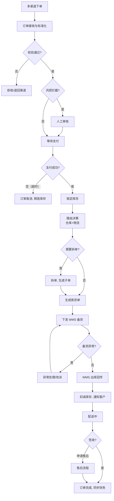

---

## 5. 功能需求详述

### 5.1 订单接收与标准化

#### 5.1.1 需求描述
统一接入各渠道订单，转换为内部标准订单模型，并完成数据校验、去重、风控。

#### 5.1.2 功能清单
| 功能 ID | 功能名 | 优先级 | 说明 |
|---------|--------|--------|------|
| ORD-01 | 多渠道订单接入 | P0 | 支持天猫/京东/抖音/拼多多/线下门店/APP/电话/B2B |
| ORD-02 | 订单格式标准化 | P0 | 各渠道字段映射到统一模型 |
| ORD-03 | 订单数据校验 | P0 | 必填字段、格式、地址三级联动校验 |
| ORD-04 | 重复订单识别 | P0 | 通过渠道单号 + 渠道编码去重，5 分钟窗口 |
| ORD-05 | 风控拦截 | P1 | 大额订单、黑名单地址、异常行为 |

#### 5.1.3 流程图

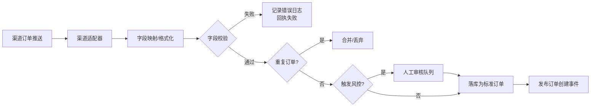

#### 5.1.4 验收标准
- 单渠道订单接入 < 2s 完成入库；
- 重复订单识别准确率 ≥ 99.9%；
- 字段校验失败时必须返回明确错误码与字段名给渠道。

---

### 5.2 路由决策引擎

#### 5.2.1 需求描述
订单支付完成后，根据库存、距离、成本、时效等综合维度，自动决策最优仓库 + 最优物流。

#### 5.2.2 功能清单
| 功能 ID | 功能名 | 优先级 | 说明 |
|---------|--------|--------|------|
| ROU-01 | 实时库存查询 | P0 | 多仓可用库存秒级查询 |
| ROU-02 | 仓库打分选择 | P0 | 距离、库存、成本三维加权 |
| ROU-03 | 仓库硬规则 | P0 | 黑名单、必发仓、安全阈值等 |
| ROU-04 | 自动切仓 | P0 | 主仓不可用时自动选次优 |
| ROU-05 | 物流硬性筛选 | P0 | 覆盖区域/资质/重量体积 |
| ROU-06 | 物流打分选择 | P0 | 时效、成本、服务质量 |
| ROU-07 | 重量/品类/金额规则 | P1 | 按维度匹配指定物流 |
| ROU-08 | VIP/渠道绑定规则 | P1 | 客户等级、渠道维度优先 |
| ROU-09 | 仓库-物流绑定 | P1 | 仓库对应物流主备 |
| ROU-10 | 大促应急切换 | P2 | 临时切换规则，支持有效期 |

#### 5.2.3 规则优先级
| 优先级 | 规则类型 | 决策方式 |
|--------|----------|----------|
| 1 | 硬规则 | 一票否决 |
| 2 | 客户等级规则 | 命中即生效 |
| 3 | 品类规则 | 命中即生效 |
| 4 | 渠道规则 | 命中即生效 |
| 5 | 默认打分规则 | 兜底加权打分 |

#### 5.2.4 流程图

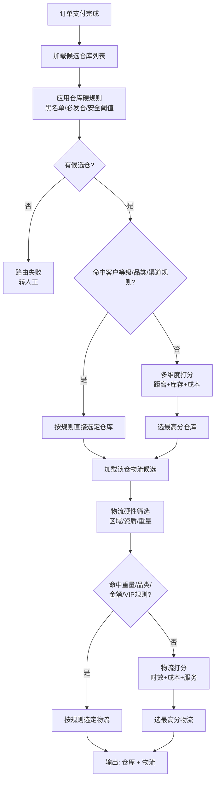

#### 5.2.5 验收标准
- 单笔路由决策 P95 < 500ms；
- 规则修改后保存即生效；
- 决策结果必须可追溯（命中哪条规则、各维度得分）。

---

### 5.3 拆单管理

#### 5.3.1 需求描述
当订单无法由单一仓库/单一包裹完成时，自动拆分为子单，母单只做汇聚与售后入口。

#### 5.3.2 功能清单
| 功能 ID | 功能名 | 优先级 | 说明 |
|---------|--------|--------|------|
| SPL-01 | 跨仓拆单 | P0 | 商品分布在多仓时按仓拆分 |
| SPL-02 | 超重拆单 | P0 | 超出重量/体积上限自动拆分 |
| SPL-03 | 库存不足拆单 | P1 | 先发部分，剩余补货后发 |
| SPL-04 | 拆单规则配置 | P0 | 是否允许、最大子单数、品类限制 |
| SPL-05 | 母子单关联 | P0 | 编号规则 `#001 → #001-1` |
| SPL-06 | 子单独立履行 | P0 | 各子单走独立路由与状态 |
| SPL-07 | 母单状态汇聚 | P0 | 所有子单完成才置完成 |
| SPL-08 | 售后走母单 | P0 | 售后入口在母单，自动定位子单 |

#### 5.3.3 流程图

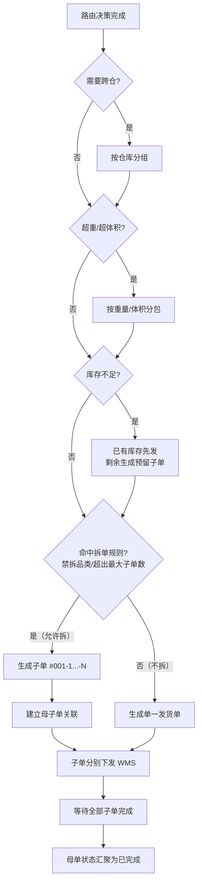

---

### 5.4 订单状态机

#### 5.4.1 状态定义
| 状态 | 触发条件 | 自动动作 |
|------|----------|----------|
| 待支付 | 订单创建 | 启动支付倒计时 |
| 已取消 | 超时未付/用户取消 | 释放锁定库存 |
| 已支付 | 支付回调成功 | 锁定库存 → 启动路由 |
| 备货中 | 路由完成 | 下发 WMS 拣货 |
| 异常 | 备货发现缺货等 | 推人工 |
| 已出库 | WMS 出库确认 | 扣减库存、生成快递单号、通知客户 |
| 配送中 | 快递揽件扫描 | 推送物流号 |
| 超时预警 | 超出承诺时效 | 通知客服跟进 |
| 已完成 | 客户签收/超时自动签收 | 同步 ERP、邀请评价 |
| 售后中 | 客户申请售后 | 启动售后流程 |

#### 5.4.2 状态机图

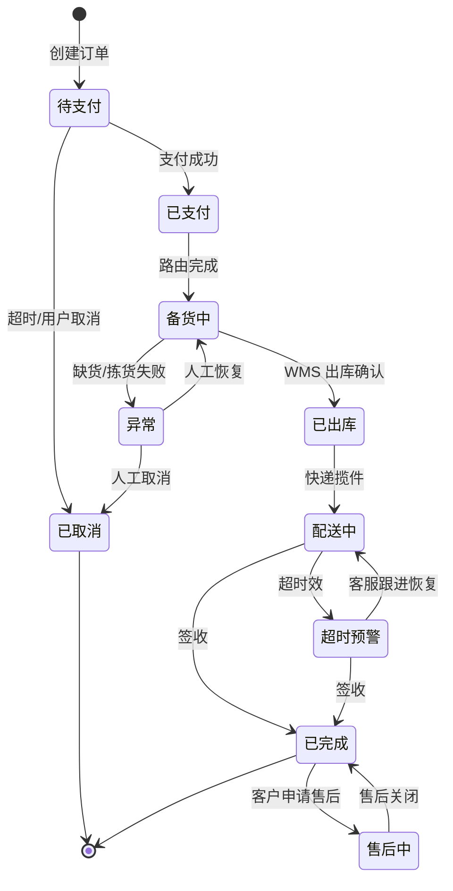

#### 5.4.3 验收标准
- 所有状态变更必须记录操作人、操作时间、来源系统；
- 状态机不允许逆向跳转，逆向必须通过补偿/客服特权操作。

---

### 5.5 库存管理

#### 5.5.1 需求描述
统一管理"实物 / 锁定 / 预留 / 可用"四态库存，对外只暴露可用库存，防止超卖与长期占用。

#### 5.5.2 功能清单
| 功能 ID | 功能名 | 优先级 | 说明 |
|---------|--------|--------|------|
| INV-01 | 库存分层管理 | P0 | 四态库存独立维护 |
| INV-02 | 下单锁定 | P0 | 支付成功即锁定 |
| INV-03 | 换货预留 | P0 | 换货审核通过后预留新品 |
| INV-04 | 预留超时释放 | P0 | 默认 7 天，可配 |
| INV-05 | 退货库存恢复 | P0 | 验货通过后入库 |
| INV-06 | 安全阈值 | P1 | 低于阈值不参与路由 |
| INV-07 | 实时库存同步 | P0 | 变动后推各电商平台 |
| INV-08 | 大促库存缓冲 | P1 | 对外少推 N 件作安全垫 |

#### 5.5.3 流程图

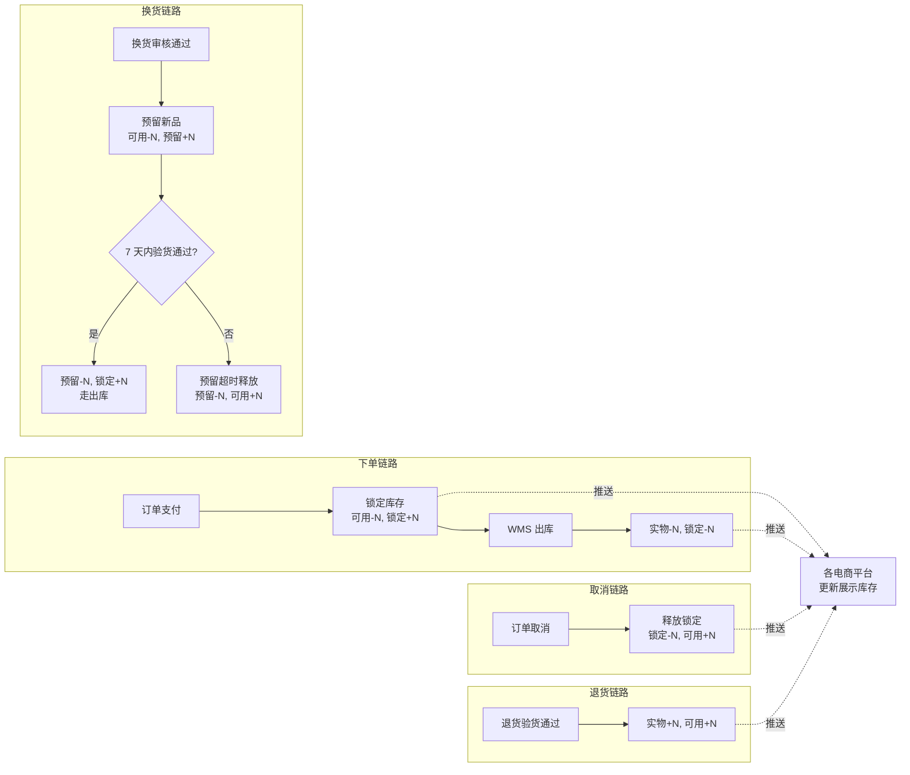

---

### 5.6 售后管理

#### 5.6.1 需求描述
覆盖退货退款、仅退款、换货三大场景，与 WMS、支付、平台四方协同。

#### 5.6.2 功能清单
| 功能 ID | 功能名 | 优先级 | 说明 |
|---------|--------|--------|------|
| AFS-01 | 售后申请接收 | P0 | APP/客服/平台多入口 |
| AFS-02 | 资格校验 | P0 | 有效期、订单真实性 |
| AFS-03 | 退货面单生成 | P0 | 自动生成快递面单 |
| AFS-04 | 退货入库单 | P0 | 下发 WMS |
| AFS-05 | 验货结果接收 | P0 | WMS 回传通过/不通过 |
| AFS-06 | 退款触发 | P0 | 原路退回 |
| AFS-07 | 仅退款处理 | P0 | 未发货/低价值/丢件场景 |
| AFS-08 | 换货预留 + 新单 | P0 | 验货通过后生成新发货单 |
| AFS-09 | 售后状态同步 | P0 | 回传平台、通知客户 |

#### 5.6.3 流程图：退货退款

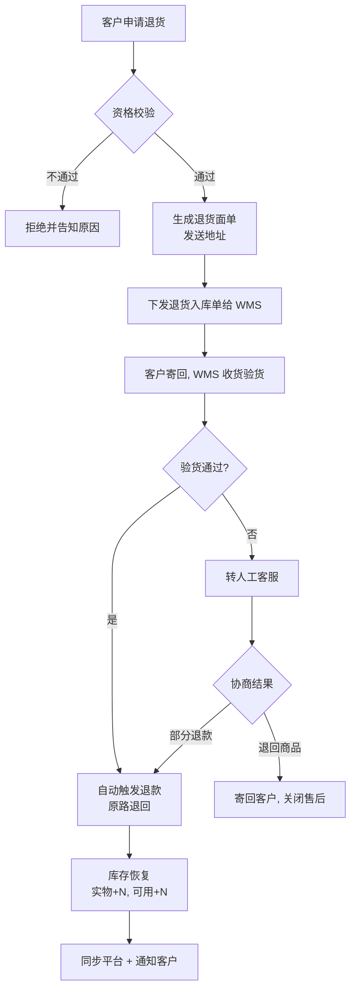

#### 5.6.4 流程图：仅退款

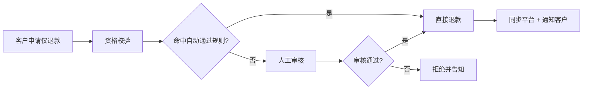

#### 5.6.5 流程图：换货

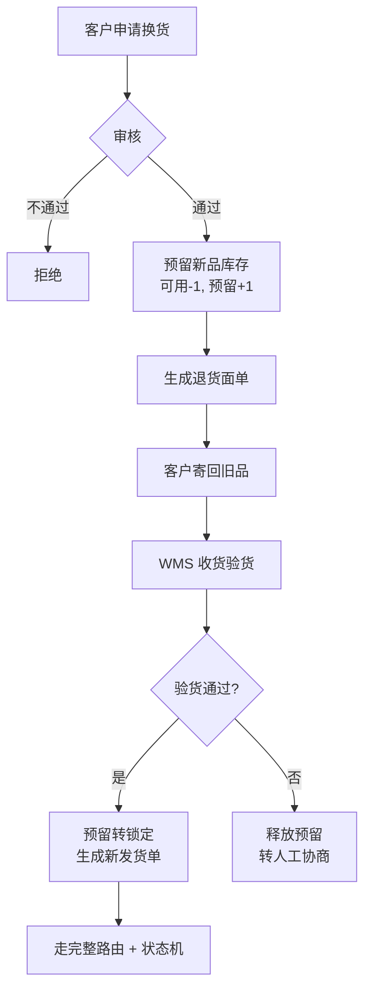

---

### 5.7 单据管理

| 功能 ID | 功能名 | 优先级 | 说明 |
|---------|--------|--------|------|
| DOC-01 | 单据编号自动生成 | P0 | 前缀 + 日期 + 流水号，例：`PK-20260523-001` |
| DOC-02 | 单据类型管理 | P0 | PK 拣货 / RT 退货入库 / RES 预留 / EX 换货 / SO 销售订单 |
| DOC-03 | 单据关联追溯 | P0 | 通过关联编号构建链路 |
| DOC-04 | OMS→WMS 指令下发 | P0 | 拣货、退货入库、预留 |
| DOC-05 | WMS 结果回传接收 | P0 | 出库确认、验货结果 |

---

### 5.8 系统对接

#### 5.8.1 系统拓扑

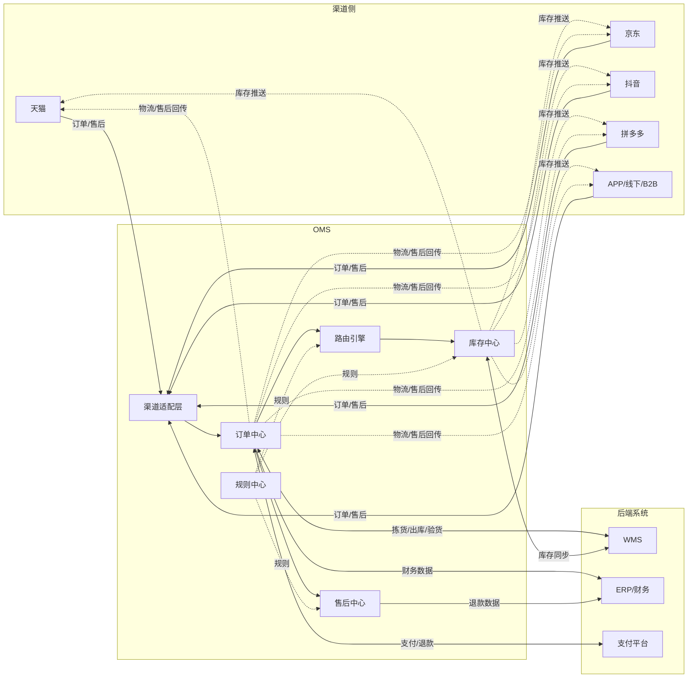

#### 5.8.2 对接清单
| 模块 | 关键接口 | 优先级 |
|------|----------|--------|
| 电商平台 | 订单拉取、库存推送、物流回传、售后同步、Token 管理 | P0 |
| WMS | 拣货下发、出库确认、退货入库、库存同步 | P0 |
| 支付 | 支付回调、退款发起、对账 | P0 |
| ERP | 财务记账、退款凭证 | P0 |

---

### 5.9 消息通知

| 功能 ID | 触发场景 | 接收方 | 渠道 |
|---------|----------|--------|------|
| MSG-01 | 出库完成 | 客户 | 短信 / APP / 平台 |
| MSG-02 | 拆单 | 客户 | 短信 / APP |
| MSG-03 | 售后节点 | 客户 | 短信 / APP / 平台 |
| MSG-04 | 配送超时、库存预警 | 客服/运营 | 钉钉/邮件 |
| MSG-05 | 备货通知 | WMS | 系统接口 |

---

### 5.10 后台规则配置

| 功能 ID | 功能名 | 优先级 |
|---------|--------|--------|
| CFG-01 | 仓库路由规则 | P0 |
| CFG-02 | 物流路由规则 | P0 |
| CFG-03 | 拆单规则 | P0 |
| CFG-04 | 库存规则 | P0 |
| CFG-05 | 规则优先级管理 | P0 |
| CFG-06 | 规则即时生效 | P0 |
| CFG-07 | 大促临时规则（带有效期） | P1 |

**强制要求：**
- 所有规则变更必须有审计日志（谁、何时、改了什么）；
- 重要规则（路由、库存阈值）需要二人复核；
- 规则上线/回滚一键完成。

---

## 6. 非功能性需求

| 类别 | 指标 |
|------|------|
| 性能 | 单笔下单 ≤ 2s；路由决策 P95 < 500ms；库存查询 P95 < 100ms |
| 容量 | 支持日订单量 ≥ 100 万；峰值 QPS ≥ 2000 |
| 可用性 | 核心链路（下单/支付/路由）≥ 99.95% |
| 一致性 | 库存最终一致 ≤ 1s；状态变更日志不可丢失 |
| 安全 | 所有外部接口签名 + 限流；敏感字段（手机号、地址）脱敏存储 |
| 可观测 | 全链路 traceId、关键节点埋点、状态机变更可视化 |
| 容灾 | 支持多机房双活；规则配置中心独立部署 |

---

## 7. 数据模型（关键实体）

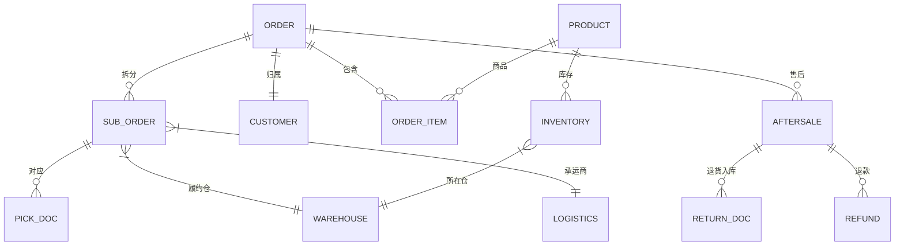

---

## 8. 上线节奏（建议）

| 阶段 | 范围 | 周期 |
|------|------|------|
| M1 | 订单接收 + 标准化 + 状态机 + 单据 + WMS 对接 | 6 周 |
| M2 | 路由引擎 + 库存四态 + 平台库存推送 | 6 周 |
| M3 | 拆单 + 多仓多物流 + 规则配置后台 | 4 周 |
| M4 | 售后全链路 + 支付/ERP 对接 + 消息通知 | 6 周 |
| M5 | 大促应急、可观测、性能压测、灰度上线 | 4 周 |

---

## 9. 验收标准（总体）

1. 多渠道订单接入率 100%，标准化字段无缺失；
2. 路由决策可解释（命中规则 + 各维度得分留痕）；
3. 库存超卖率 ≤ 0.05%，预留超时自动释放；
4. 售后端到端平均处理时长 ≤ 24h；
5. 运营规则修改保存即生效，无需研发发版；
6. 全链路日志 + 状态机变更可追溯；
7. 性能、可用性指标达到第 6 节要求。

---

## 10. 风险与依赖

| 风险/依赖 | 影响 | 缓解措施 |
|-----------|------|----------|
| 各电商平台 API 变更 | 接单中断 | 渠道适配层抽象 + 监控告警 |
| WMS 出入库回传不及时 | 状态卡住 | 超时补偿 + 人工恢复入口 |
| 大促流量峰值 | 路由/库存抖动 | 压测 + 限流 + 大促规则切换 |
| 规则配置错误 | 履约异常 | 二人复核 + 灰度发布 + 一键回滚 |
| 跨系统库存一致性 | 超卖/积压 | 库存中心唯一 source of truth |

---

*文档基于 [OMS功能列表.md](./OMS功能列表.md) 落地，覆盖十大模块的需求、流程、状态机、数据模型与上线节奏。*
