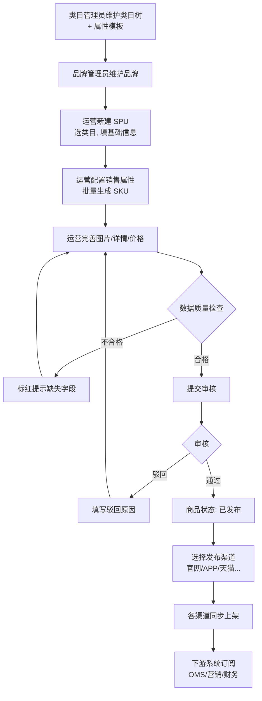
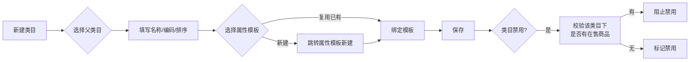
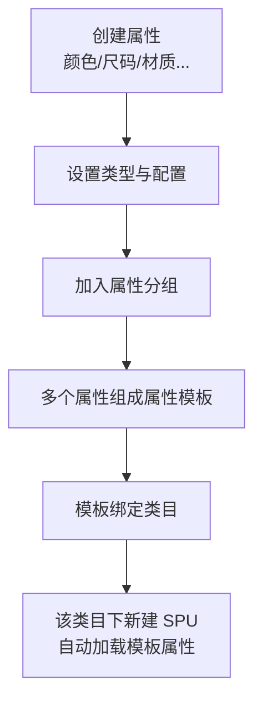
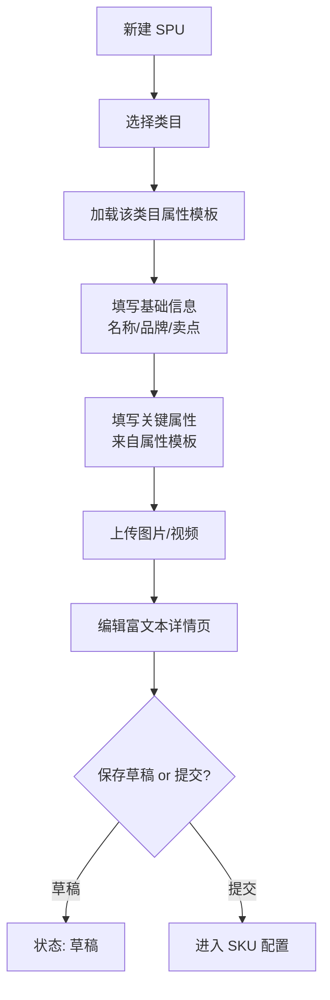
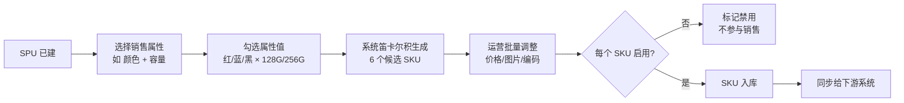
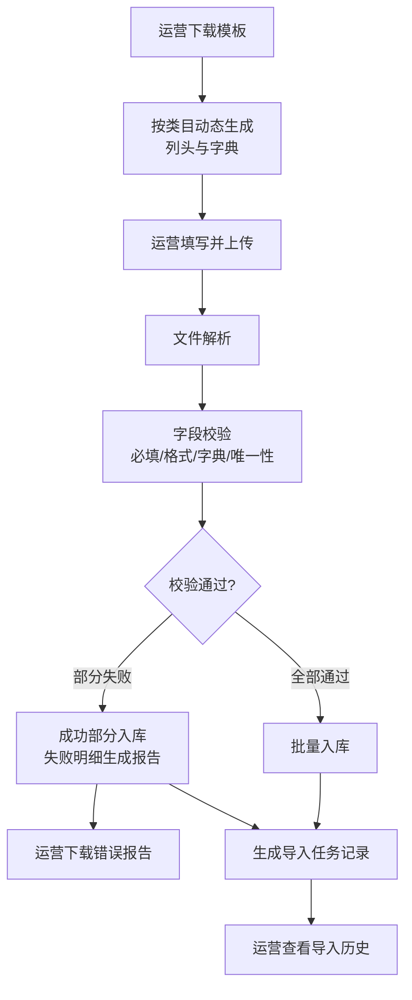
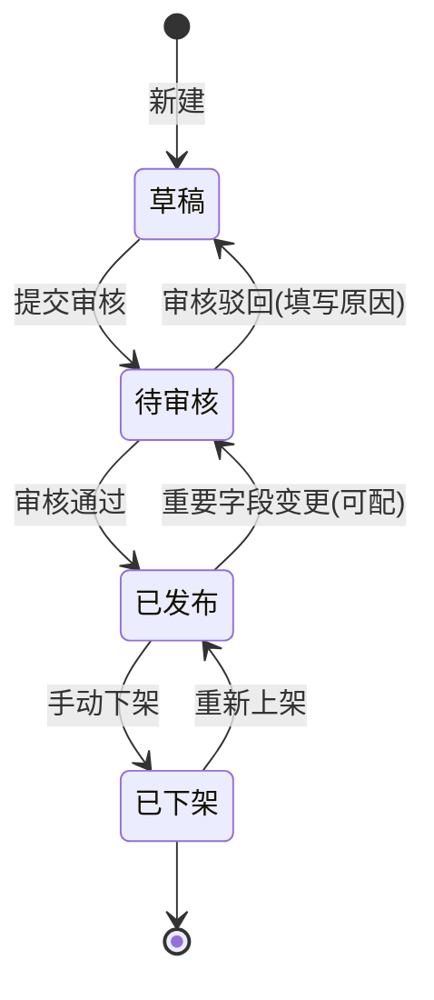
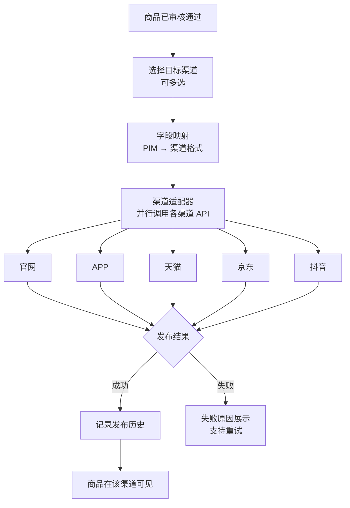
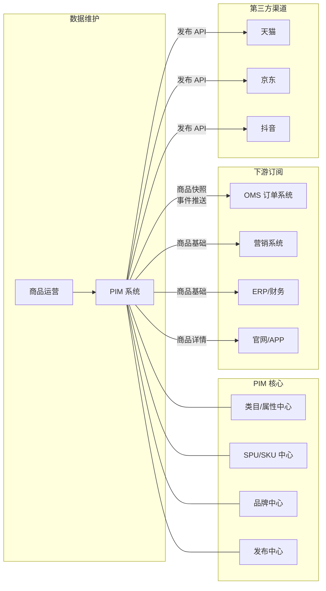
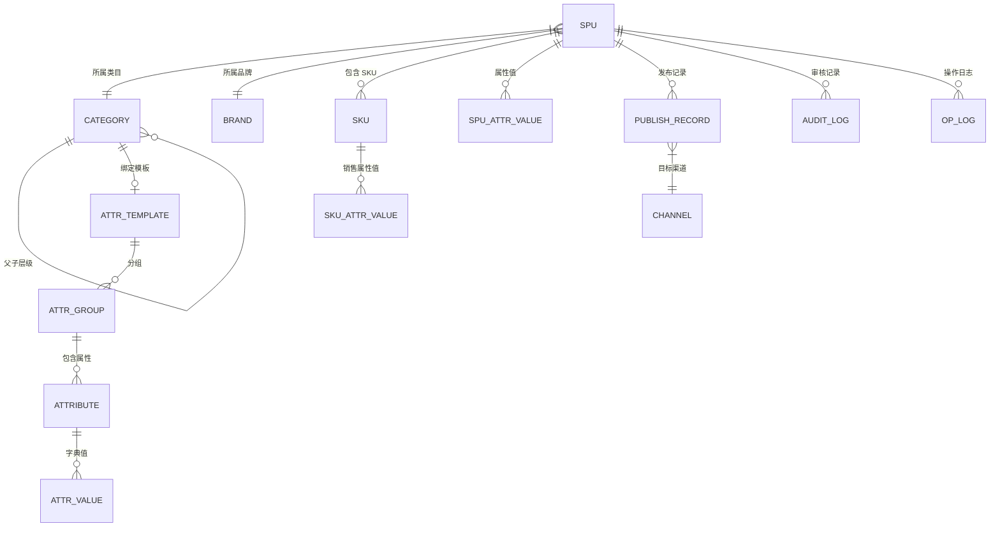

# PIM 产品信息管理系统 PRD

| 项目 | 内容 |
|------|------|
| 文档版本 | v1.0 |
| 编写日期 | 2026-05-23 |
| 文档状态 | 草稿（待评审） |
| 关联文档 | [PIM功能清单.md](./PIM功能清单.md)、[../OMS/OMS-PRD.md](../OMS/OMS-PRD.md) |
| 目标读者 | 产品、研发、测试、运营、商品中台 |

---

## 1. 项目背景与目标

### 1.1 背景
当前商品信息散落在各电商渠道（官网、APP、天猫、京东、抖音等）和多套业务系统中：
- 同一商品在不同渠道字段不一致、图片不统一、价格混乱；
- 新品上市需要在每个渠道重复录入，效率低、易出错；
- 商品类目和属性缺乏统一标准，搜索和筛选体验差；
- 商品上下架、库存、价格变更难以同步，运营响应慢；
- OMS / 营销 / 财务系统各自维护商品，数据无单一来源。

### 1.2 项目目标
建设统一的 PIM（Product Information Management），实现：
1. **商品一处维护**：SPU/SKU 单一数据源，下游订阅。
2. **类目属性标准化**：类目模板化、属性结构化，支持搜索筛选。
3. **多渠道一键发布**：一次录入、按需发布到 N 个渠道。
4. **批量高效作业**：Excel 模板化导入，单次万级商品 < 5 分钟。
5. **数据质量可控**：完整度评分 + 审核工作流，确保上线即合规。

### 1.3 非目标（Out of Scope）
- 库存数量管理（由 OMS / WMS 负责）；
- 实际订单履约（由 OMS 负责）；
- 营销活动、优惠券、价格策略组合（由营销系统负责）；
- 财务核算（由 ERP 负责）。

PIM 只负责**商品本身的信息**（"长什么样"），不负责"卖多少、卖给谁、怎么发"。

---

## 2. 名词解释

| 名词 | 解释 |
|------|------|
| PIM | Product Information Management，产品信息管理系统 |
| SPU | Standard Product Unit，标准产品单元，如"iPhone 15 Pro" |
| SKU | Stock Keeping Unit，库存最小单位，如"iPhone 15 Pro 256G 黑色" |
| 类目 | 商品分类树，如 数码 > 手机 > 智能手机 |
| 属性 | 描述商品的字段，如品牌、颜色、内存 |
| 属性模板 | 一组绑定到类目的属性集合 |
| 销售属性 | 用于区分 SKU 的属性（颜色、尺码） |
| 关键属性 | 商品搜索/筛选用的属性（品牌、材质） |
| 渠道 | 商品发布的目标平台（官网、APP、天猫…） |

---

## 3. 用户角色与权限

| 角色 | 主要场景 | 关键权限 |
|------|----------|----------|
| 商品运营 | 录入、编辑、发布商品 | 商品 CRUD、批量导入、发布 |
| 商品审核员 | 审核新商品/变更 | 审核通过/驳回、查看审核记录 |
| 类目管理员 | 维护类目树、属性模板 | 类目、属性、品牌 CRUD |
| 渠道运营 | 渠道发布与下架 | 渠道发布、单渠道上下架 |
| 系统管理员 | 用户/权限/对接配置 | 全部 |
| 下游系统 | 订阅商品数据 | 只读 API |

---

## 4. 整体业务流程

---

## 5. 功能需求详述

### 5.1 类目管理

#### 5.1.1 需求描述
维护商品类目树，是属性模板、商品归属、搜索筛选的基础。

#### 5.1.2 功能清单
| 功能 ID | 功能名 | 优先级 | 说明 |
|---------|--------|--------|------|
| CAT-01 | 类目树 CRUD | P0 | 增删改查，支持拖拽调整层级 |
| CAT-02 | 多级类目 | P0 | 支持 3~5 级，最深 5 级 |
| CAT-03 | 类目排序 | P0 | 同级排序，影响前台展示顺序 |
| CAT-04 | 类目启用/禁用 | P0 | 禁用后新商品不可挂靠 |
| CAT-05 | 绑定属性模板 | P0 | 一个类目绑定一套属性集 |
| CAT-06 | 类目下商品计数 | P1 | 显示该类目下商品数，禁用时校验 |

#### 5.1.3 流程图

#### 5.1.4 验收标准
- 类目层级 ≤ 5 级；
- 父类目禁用必须级联校验子类目；
- 类目编码全局唯一。

---

### 5.2 属性管理

#### 5.2.1 需求描述
管理商品的描述字段，并通过"属性模板"批量挂载到类目。

#### 5.2.2 功能清单
| 功能 ID | 功能名 | 优先级 | 说明 |
|---------|--------|--------|------|
| ATR-01 | 属性 CRUD | P0 | 增删改查 |
| ATR-02 | 属性类型 | P0 | 文本/数字/单选/多选/日期/图片/富文本 |
| ATR-03 | 属性配置项 | P0 | 必填、可搜索、可筛选、是否销售属性 |
| ATR-04 | 属性分组 | P0 | 基础信息、规格参数、销售属性等 |
| ATR-05 | 属性模板 | P0 | 一组属性 + 分组，绑定到类目 |
| ATR-06 | 属性值字典 | P1 | 单选/多选属性的可选值字典管理 |

#### 5.2.3 属性 → 模板 → 类目流程

#### 5.2.4 验收标准
- 属性编码全局唯一；
- 属性被使用后不可删除，只能禁用；
- 模板调整需提示影响范围（多少商品）。

---

### 5.3 SPU 管理

#### 5.3.1 需求描述
SPU 是商品的"产品单元"，承载基础信息、详情页、图片、视频。

#### 5.3.2 功能清单
| 功能 ID | 功能名 | 优先级 | 说明 |
|---------|--------|--------|------|
| SPU-01 | SPU 新建/编辑/删除 | P0 | 删除需校验是否有在售 SKU |
| SPU-02 | 基础信息 | P0 | 名称、品牌、类目、卖点、描述 |
| SPU-03 | 富文本详情页 | P0 | 支持图文混排、视频嵌入 |
| SPU-04 | 图片管理 | P0 | 主图（1-5 张）+ 详情图 |
| SPU-05 | 视频上传 | P1 | 主视频，单个 ≤ 100MB |
| SPU-06 | 状态管理 | P0 | 草稿/待审核/已发布/已下架 |
| SPU-07 | 类目切换 | P1 | 切换类目后需重新映射属性 |

#### 5.3.3 SPU 创建流程

---

### 5.4 SKU 管理

#### 5.4.1 需求描述
SKU 是商品的"售卖单元"，由销售属性的组合生成。

#### 5.4.2 功能清单
| 功能 ID | 功能名 | 优先级 | 说明 |
|---------|--------|--------|------|
| SKU-01 | 批量生成 | P0 | 选定销售属性后自动笛卡尔积生成 |
| SKU-02 | 单 SKU 编辑 | P0 | 价格、独立图片、SKU 编码、条码 |
| SKU-03 | SKU 启用/禁用 | P0 | 禁用后下游不可销售 |
| SKU-04 | SKU 删除 | P1 | 校验是否有未完成订单 |
| SKU-05 | SKU 编码规则 | P0 | 支持自动生成或手动维护 |

#### 5.4.3 SKU 生成流程

#### 5.4.4 验收标准
- 单个 SPU 下 SKU 数 ≤ 500；
- SKU 编码全局唯一；
- SKU 禁用必须校验是否有进行中订单。

---

### 5.5 品牌管理

| 功能 ID | 功能名 | 优先级 | 说明 |
|---------|--------|--------|------|
| BRD-01 | 品牌 CRUD | P0 | 增删改查 |
| BRD-02 | 品牌 Logo | P0 | 上传 + 多尺寸自动裁切 |
| BRD-03 | 品牌关联商品 | P0 | 查看品牌下所有商品 |
| BRD-04 | 品牌启用/禁用 | P1 | 禁用品牌不能新建商品 |

---

### 5.6 数据导入导出

#### 5.6.1 需求描述
通过 Excel 模板支持商品批量录入与导出，是 PIM 提效的核心。

#### 5.6.2 功能清单
| 功能 ID | 功能名 | 优先级 | 说明 |
|---------|--------|--------|------|
| IO-01 | 模板下载 | P0 | 按类目动态生成对应字段模板 |
| IO-02 | Excel 导入 | P0 | 支持 SPU + SKU 一并导入 |
| IO-03 | 导入校验 | P0 | 必填、格式、字典值、唯一性校验 |
| IO-04 | 导入结果反馈 | P0 | 成功/失败统计 + 失败明细下载 |
| IO-05 | 批量导出 | P0 | 按筛选条件导出 Excel |
| IO-06 | 异步导入 | P1 | 大批量走任务队列，进度可查 |

#### 5.6.3 Excel 导入流程

#### 5.6.4 验收标准
- 单次导入 ≤ 1 万行，5 分钟内完成；
- 失败行必须返回行号 + 字段名 + 原因；
- 部分失败不影响成功行入库。

---

### 5.7 数据质量

| 功能 ID | 功能名 | 优先级 | 说明 |
|---------|--------|--------|------|
| DQ-01 | 完整度评分 | P1 | 必填字段填写率，0-100 分 |
| DQ-02 | 缺失数据提醒 | P1 | 商品列表标红，列表筛选缺失项 |
| DQ-03 | 批量检查未上传图片 | P1 | 一键筛选 + 跳转批量补全 |
| DQ-04 | 数据质量报表 | P2 | 按类目/品牌/运营人维度统计 |

---

### 5.8 审核工作流

#### 5.8.1 需求描述
新商品上架与重要字段变更需经过审核，控制数据质量与合规风险。

#### 5.8.2 功能清单
| 功能 ID | 功能名 | 优先级 | 说明 |
|---------|--------|--------|------|
| AUD-01 | 提交审核 | P0 | 草稿 → 待审核 |
| AUD-02 | 审核通过/驳回 | P0 | 通过 → 已发布；驳回 → 草稿 |
| AUD-03 | 驳回原因 | P0 | 必填，最少 5 字 |
| AUD-04 | 审核记录 | P0 | 操作人、时间、结果、备注 |
| AUD-05 | 变更审核 | P1 | 价格、图片等关键字段变更也需审核（可配） |
| AUD-06 | 审核免审白名单 | P2 | 部分类目/角色可跳过 |

#### 5.8.3 审核工作流

---

### 5.9 发布与渠道

#### 5.9.1 需求描述
商品审核通过后，按需发布到 N 个销售渠道；不同渠道可独立上下架。

#### 5.9.2 功能清单
| 功能 ID | 功能名 | 优先级 | 说明 |
|---------|--------|--------|------|
| PUB-01 | 渠道配置 | P0 | 维护渠道列表（官网/APP/天猫/京东/抖音/海外站） |
| PUB-02 | 发布到渠道 | P0 | 单/批量勾选渠道发布 |
| PUB-03 | 单渠道上下架 | P0 | 不影响其他渠道 |
| PUB-04 | 渠道字段映射 | P1 | PIM 字段 → 渠道字段适配 |
| PUB-05 | 发布历史 | P0 | 每次发布动作可追溯 |
| PUB-06 | 发布失败重试 | P1 | 失败原因可见 + 一键重试 |

#### 5.9.3 多渠道发布流程

---

### 5.10 搜索与筛选

| 功能 ID | 功能名 | 优先级 | 说明 |
|---------|--------|--------|------|
| SCH-01 | 关键字搜索 | P0 | 名称、SKU 编码、SPU 编码 |
| SCH-02 | 条件筛选 | P0 | 类目、品牌、状态、渠道、完整度 |
| SCH-03 | 批量操作 | P0 | 批量上架/下架/删除/修改类目 |
| SCH-04 | 自定义列 | P1 | 运营自选展示列 |
| SCH-05 | 收藏筛选条件 | P2 | 常用筛选一键调用 |

---

### 5.11 权限管理

| 功能 ID | 功能名 | 优先级 | 说明 |
|---------|--------|--------|------|
| AUTH-01 | 角色管理 | P0 | 管理员/运营/审核员/类目管理员/渠道运营 |
| AUTH-02 | 功能权限 | P0 | 菜单 + 按钮级 |
| AUTH-03 | 数据权限 | P1 | 按类目/品牌限制可操作范围 |
| AUTH-04 | 操作日志 | P0 | 所有写操作留痕 |
| AUTH-05 | 单点登录 | P2 | 对接公司 SSO |

---

## 6. 与下游系统对接

### 6.1 系统拓扑

### 6.2 对接清单
| 下游系统 | 同步内容 | 方式 |
|----------|----------|------|
| OMS | SPU/SKU、类目、品牌、基础属性 | 事件 + 全量定时对账 |
| 营销系统 | SPU/SKU、品牌、类目 | 事件 |
| ERP | SKU、价格、编码 | 事件 + API 查询 |
| 官网/APP | 完整商品详情、图片、富文本 | 缓存 + CDN |
| 第三方电商 | 字段映射后的商品 | 平台 API |

---

## 7. 非功能性需求

| 类别 | 指标 |
|------|------|
| 性能 | 商品保存 ≤ 1s；搜索 P95 < 300ms；批量导入 1 万行 ≤ 5 分钟 |
| 容量 | 支持 SPU ≥ 100 万；SKU ≥ 500 万 |
| 可用性 | 核心 API ≥ 99.9% |
| 一致性 | 商品变更最终一致 ≤ 5s（下游订阅） |
| 安全 | 操作权限 + 操作日志 + 图片防盗链 |
| 可观测 | 全链路日志 + 发布失败告警 |

---

## 8. 数据模型（核心实体）

---

## 9. 上线节奏（建议）

| 阶段 | 范围 | 周期 |
|------|------|------|
| M1 | 类目、属性、品牌、SPU/SKU 基础 CRUD | 5 周 |
| M2 | 搜索筛选、批量操作、Excel 导入导出 | 4 周 |
| M3 | 多渠道发布、字段映射、发布历史 | 4 周 |
| M4 | 审核工作流、数据质量评分、操作日志 | 3 周 |
| M5 | 权限管理、SSO、性能压测与灰度上线 | 3 周 |

---

## 10. 验收标准（总体）

1. 商品数据维护从"多系统重复录入"变为"PIM 单一入口"；
2. 类目-属性-模板三级结构清晰，新增类目 ≤ 10 分钟可上线；
3. 单 SPU 全字段保存 ≤ 1s；批量导入 1 万条 ≤ 5 分钟；
4. 一次发布可同步 ≥ 5 个渠道，失败可追溯可重试；
5. 关键字段变更全部留痕，可审计；
6. 下游系统（OMS / 营销 / 财务 / APP）订阅延迟 ≤ 5s；
7. 性能、可用性指标达到第 7 节要求。

---

## 11. 风险与依赖

| 风险/依赖 | 影响 | 缓解措施 |
|-----------|------|----------|
| 第三方电商 API 变更 | 发布失败 | 渠道适配层抽象 + 监控告警 |
| 大量历史数据迁移 | 上线延期 | 迁移工具 + 灰度并行 |
| 类目模型设计不合理 | 后续重构成本高 | 上线前与业务方多轮评审 + 留扩展位 |
| 图片/视频存储成本 | 成本快速上涨 | 接入对象存储 + CDN + 生命周期策略 |
| 与 OMS 字段不一致 | 订单履约错误 | 字段契约文档化 + 双向自动化测试 |

---

*文档基于 [PIM功能清单.md](./PIM功能清单.md) 落地，覆盖类目、属性、商品（SPU/SKU）、品牌、导入导出、数据质量、审核、发布、搜索、权限十大模块。*
