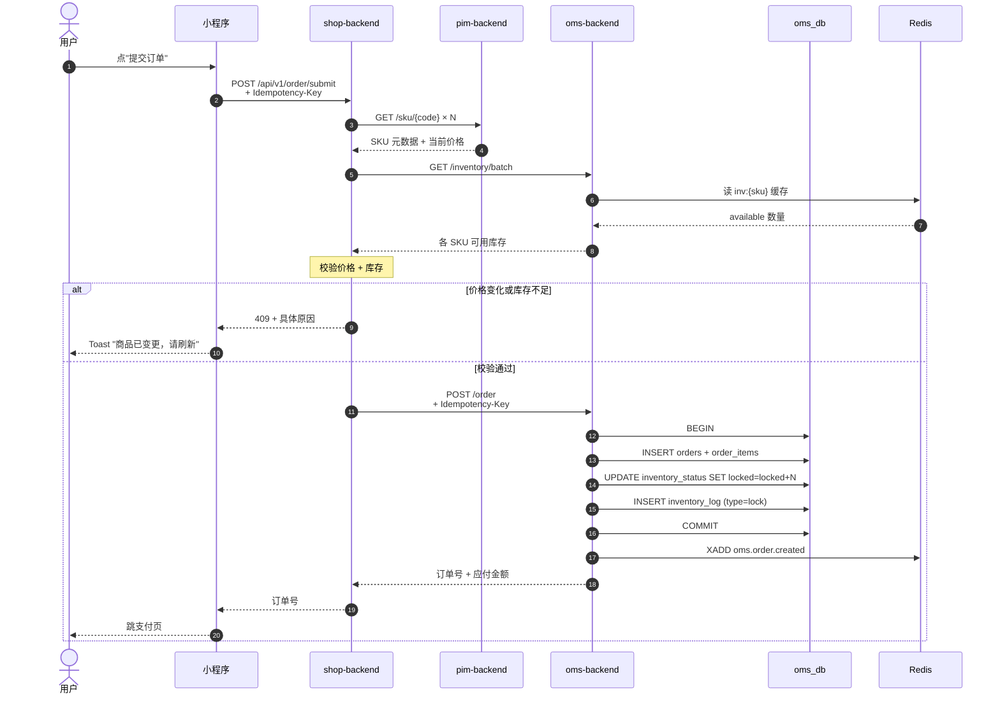
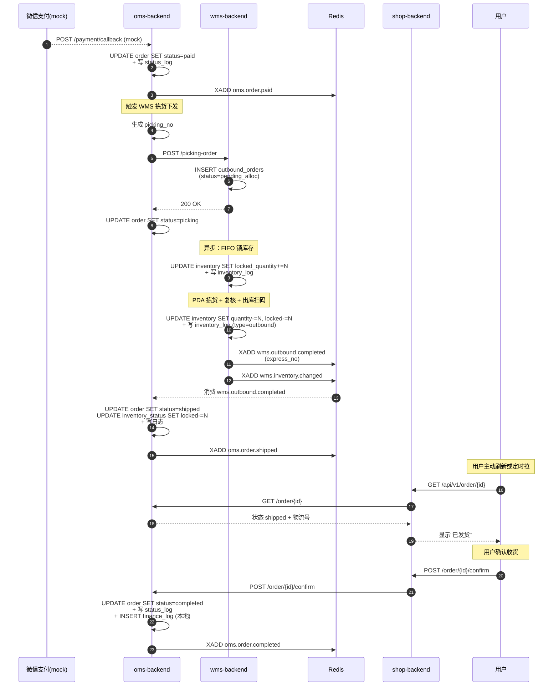
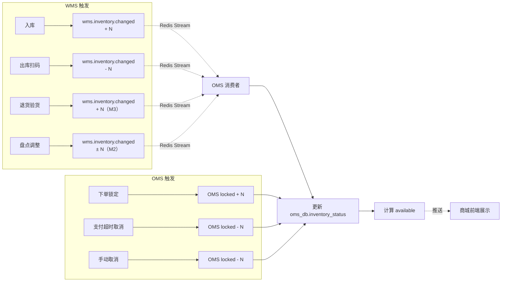

# data-flow.md · 关键数据流

## 【当前焦点】
4 条关键端到端数据流：**下单 / 履约 / 售后（占位）/ 库存**。
每条流明确：触发点 → 涉及系统 → 数据变更 → 事件推送 → 异常分支。

## 本任务匹配到的 skill 清单
- 架构 Agent 当前无强匹配 skill

---

## 一、下单数据流

### 时序图（用户提交订单 → OMS 锁库存）


### 数据变更摘要
| 步骤 | 库 / 表 | 变更 |
|---|---|---|
| 9 | oms_db.orders | INSERT 一条新订单（status=pending_pay）|
| 9 | oms_db.order_items | INSERT 商品明细 |
| 9 | oms_db.inventory_status | available -N, locked +N |
| 9 | oms_db.inventory_log | INSERT 一条 lock 流水 |
| 11 | redis | XADD oms.order.created |

### 异常分支
- 价格不一致 → 409 + 商城提示"刷新重试"
- 库存不足 → 409 + 商城提示具体商品
- OMS 接口超时（> 3s）→ 商城提示"提交失败"，不创建订单
- Idempotency-Key 重复 → 返回首次结果，不重复创建

---

## 二、履约数据流

### 时序图（支付成功 → 出库 → 用户收货）


### 数据变更摘要
| 步骤 | 库 / 表 | 变更 |
|---|---|---|
| 2 | oms_db.orders | status pending_pay → paid |
| 2 | oms_db.order_status_log | INSERT |
| 7 | wms_db.outbound_orders | INSERT pending_alloc |
| 9 | oms_db.orders | status paid → picking |
| 11 | wms_db.inventory | locked_quantity +N |
| 13-14 | wms_db.inventory | quantity -N, locked_quantity -N |
| 14 | wms_db.inventory_log | INSERT outbound |
| 18 | oms_db.orders | status picking → shipped |
| 18 | oms_db.inventory_status | locked -N |
| 24 | oms_db.orders | status shipped → completed |
| 24 | oms_db.finance_log | INSERT（本地，不外推）|

### 异常分支
- WMS 短拣（库存不够实际数）→ XADD wms.picking.shortage → OMS status picking → exception
- 出库回传失败 → 重试 3 次 + 入死信队列 + 告警
- WMS 出库后 OMS 处理失败 → Stream 重试 + 最终人工介入

---

## 三、售后数据流（占位，MVP 不实现）

### 占位说明
售后流程涉及退货退款 / 仅退款 / 换货三种场景，MVP 阶段全部推迟到 M3。

### 占位 API
本期保留接口签名但返回 501 Not Implemented：
- `POST /api/v1/aftersale`（创建售后单）
- `GET /api/v1/aftersale/{id}`（查询售后单）

### 完整数据流参考
见 [电商系统整体架构.md](../../../电商系统整体架构.md) §6.3。M3 启动时按该流程实现。

---

## 四、库存数据流（最易出错）

### 四态库存定义（OMS）
```
available（可用）= 实物（WMS quantity）- WMS locked - OMS locked - OMS reserved（M1 固定 0）
                  ↑ 商城展示用的数字 ↑
```

### 库存变动事件流


### 关键约束
1. **OMS 是对外可用库存的单一真相源**（商城/平台展示）
2. **WMS 是实物的单一真相源**
3. **OMS 不主动写 WMS 库存**（仅订阅事件）
4. **WMS 不存"已锁定"的对外语义**（只存内部 `locked_quantity` 用于拣货）
5. **库存对账每日跑**（OMS 一致性校验）

### 防超卖三层校验
| 层级 | 校验点 | 实现 |
|---|---|---|
| 1 | 商城下单前 | GET /inventory 预校验（弱校验，仅 UX 提示）|
| 2 | OMS 锁定时 | UPDATE ... WHERE available >= N（原子）|
| 3 | WMS 拣货锁定时 | UPDATE inventory SET locked+=N WHERE quantity-locked >= N（原子）|

任一层失败立即中断，库存绝不超卖。

### 库存对账（每日凌晨）
```
对账规则：
  OMS available + OMS locked == SUM(WMS quantity) - SUM(WMS locked_quantity)

不一致时：
  - INSERT oms_db.inventory_reconcile_log（差异明细）
  - 写告警日志
  - 不自动修正，等人工处理（M1）
```

---

## 五、数据流监控点（MVP 阶段，仅日志）

| 监控点 | 期望 | 实现 |
|---|---|---|
| 下单 P95 | < 2s | 接口日志 |
| 路由（M1 简化为下发 WMS）P95 | < 1s | 接口日志 |
| 库存查询 P95 | < 100ms | 接口日志 |
| WMS 出库回传延迟 | < 5s | Stream 消费日志 |
| 死信队列条数 | == 0 | DB 表 + 日志 |
| 库存对账差异条数 | == 0 | 对账日志 |

MVP 不接 APM / Grafana / Prometheus，仅在日志文件中 grep。Phase 4+ 引入完整监控。
