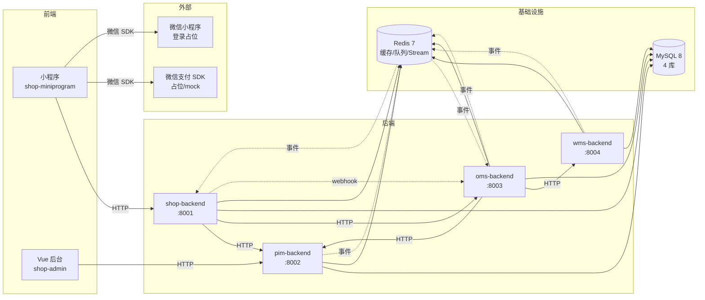

# module-deps.md · 模块依赖关系

## 【当前焦点】
4 个 PHP 工程内部模块划分 + 工程之间的依赖方向 + 外部依赖（微信支付/小程序）。
依赖方向严格遵循 [电商系统整体架构.md](../../../电商系统整体架构.md) §2.1 边界图。

## 本任务匹配到的 skill 清单
- 架构 Agent 当前无强匹配 skill

---

## 一、跨工程依赖图



**关键约束**：
- ✅ 小程序只调 shop-backend，不直连 PIM/OMS/WMS
- ✅ Vue 后台 MVP 阶段只调 PIM（仅证骨架）
- ✅ shop-backend 是"BFF"（Backend for Frontend），负责聚合 PIM/OMS 数据
- ✅ OMS↔WMS 是双向（OMS 下发拣货单 + WMS 回传出库）
- ✅ 事件流单向（生产者推 Stream → 消费者订阅）

---

## 二、各工程内部模块（ThinkPHP 多应用模式）

### 2.1 shop-backend（商城后端）
```
shop-backend/
├── app/
│   ├── api/            ← 给小程序的 BFF 接口
│   │   ├── controller/
│   │   │   ├── User.php          ← 登录/注册
│   │   │   ├── Sms.php           ← 验证码
│   │   │   ├── Home.php          ← 首页接口
│   │   │   ├── Category.php      ← 类目
│   │   │   ├── Product.php       ← 商品（聚合 PIM + OMS）
│   │   │   ├── Cart.php          ← 购物车
│   │   │   ├── Order.php         ← 订单（代理 OMS）
│   │   │   ├── Payment.php       ← 支付参数
│   │   │   └── Upload.php        ← 图片上传
│   │   ├── middleware/
│   │   │   ├── AuthCheck.php     ← JWT 校验
│   │   │   ├── RateLimit.php     ← 限流
│   │   │   └── TraceId.php       ← trace 注入
│   │   ├── service/              ← 业务逻辑层
│   │   ├── model/                ← User/Cart/SmsLog
│   │   └── facade/PimClient.php / OmsClient.php  ← 调下游
│   └── admin/          ← 管理员接口（M2 用，本期占位）
├── config/
├── route/
├── tests/
└── runtime/
```

**内部依赖**：
- controller → service → model + facade
- middleware → facade（PimClient/OmsClient）

**对外依赖**：
- HTTP → pim-backend（商品 / 类目 / 品牌）
- HTTP → oms-backend（库存 / 订单 / 支付）
- 监听 Redis Stream `oms.order.status.changed` 推送状态变化（M1 可省略，前台轮询代替）

---

### 2.2 pim-backend
```
pim-backend/
├── app/
│   ├── api/
│   │   ├── controller/
│   │   │   ├── Category.php      ← 类目 CRUD
│   │   │   ├── Attribute.php     ← 属性 CRUD
│   │   │   ├── AttrTemplate.php  ← 属性模板
│   │   │   ├── Brand.php         ← 品牌
│   │   │   ├── Spu.php           ← SPU
│   │   │   ├── Sku.php           ← SKU
│   │   │   └── Upload.php        ← 图片
│   │   ├── middleware/
│   │   ├── service/
│   │   │   ├── ProductService.php
│   │   │   └── EventPublisher.php  ← 推 Stream
│   │   └── model/
├── config/ / route/ / tests/ / runtime/
```

**对外依赖**：
- 推 Redis Stream：`pim.category.changed` / `pim.brand.changed` / `pim.spu.changed` / `pim.sku.changed`
- 无外部 HTTP 调用（PIM 是源头）

---

### 2.3 oms-backend
```
oms-backend/
├── app/
│   ├── api/
│   │   ├── controller/
│   │   │   ├── Order.php         ← 订单 CRUD
│   │   │   ├── Inventory.php     ← 库存查询/预校验
│   │   │   ├── Payment.php       ← 支付回调
│   │   │   └── Admin.php         ← 后台对账接口
│   │   ├── middleware/
│   │   ├── service/
│   │   │   ├── OrderService.php
│   │   │   ├── InventoryService.php  ← 四态库存
│   │   │   ├── StateMachine.php       ← 状态机
│   │   │   └── EventPublisher.php
│   │   ├── consumer/                  ← Stream 消费者
│   │   │   ├── WmsOutboundConsumer.php
│   │   │   ├── WmsShortageConsumer.php
│   │   │   └── PimSkuChangedConsumer.php
│   │   └── model/
│   ├── command/                       ← 命令行（cron）
│   │   ├── CancelTimeoutOrder.php     ← 5min 跑一次
│   │   └── InventoryReconcile.php     ← 每日跑
│   └── facade/
│       ├── PimClient.php
│       └── WmsClient.php
├── config/ / route/ / tests/ / runtime/
```

**对外依赖**：
- HTTP → pim-backend（SKU 元数据查询）
- HTTP → wms-backend（拣货单下发）
- 推 Stream：`oms.order.*` / `oms.inventory.changed`
- 订阅 Stream：`wms.outbound.completed` / `wms.picking.shortage` / `wms.inventory.changed` / `pim.sku.changed`

---

### 2.4 wms-backend
```
wms-backend/
├── app/
│   ├── api/
│   │   ├── controller/
│   │   │   ├── Auth.php
│   │   │   ├── Product.php       ← SKU 主数据
│   │   │   ├── Warehouse.php
│   │   │   ├── Location.php
│   │   │   ├── Inbound.php
│   │   │   ├── Inventory.php
│   │   │   ├── PickingOrder.php  ← 接 OMS 拣货单
│   │   │   ├── PickingTask.php   ← PDA 任务
│   │   │   └── Outbound.php
│   │   ├── middleware/
│   │   │   ├── AuthCheck.php
│   │   │   ├── RbacCheck.php     ← 角色权限
│   │   │   └── DataScope.php     ← 数据权限按仓库
│   │   ├── service/
│   │   │   ├── InventoryService.php
│   │   │   ├── LocationRecommend.php
│   │   │   ├── PickingService.php
│   │   │   └── EventPublisher.php
│   │   ├── consumer/
│   │   │   └── PimSkuChangedConsumer.php
│   │   └── model/
├── config/ / route/ / tests/ / runtime/
```

**对外依赖**：
- 推 Stream：`wms.outbound.completed` / `wms.picking.shortage` / `wms.inventory.changed`
- 订阅 Stream：`pim.sku.changed`
- 无外部 HTTP 主动调用（被动接 OMS）

---

## 三、4 工程功能边界（数据所有权）

| 数据域 | shop | pim | oms | wms |
|---|---|---|---|---|
| 用户 / cart | **主** | - | - | - |
| 商品 / 类目 / 品牌 / SPU / SKU | 镜像/缓存 | **主** | 元数据缓存 | 镜像（仅 sku_code + weight） |
| 订单 | 代理读 | - | **主** | - |
| 库存（四态）| 不存 | - | **主** | - |
| 库存（实物）| - | - | - | **主** |
| 拣货单 / 出库单 / 入库单 | - | - | 母单 | **主**（仓内单据）|
| 支付 | 拉起 SDK | - | 触发 + 回调 | - |
| 验证码 / token | **主** | - | - | - |

---

## 四、模块依赖反模式（必须避免）

| 反模式 | 错在哪 | 正确做法 |
|---|---|---|
| 小程序直接调 PIM / OMS / WMS | 跨域 / 签名 / 限流难统一 | 走 shop-backend BFF |
| shop-backend 直连 wms-backend | 跳过 OMS，库存不一致 | OMS 是库存四态主，shop 走 OMS |
| OMS 自维护库存数量 | 与 WMS 实物不一致 | OMS 维护四态，WMS 实物，事件同步 |
| 商城后台改商品基础信息不写 PIM | 数据多源 | 所有商品修改都回写 PIM |
| WMS 上架前 SKU 不在 PIM | 无源数据 | PIM 是 SKU 源，WMS 订阅同步 |
| 跨服务调用未带 traceId | 排查脱链 | 中间件强制注入 X-Trace-Id |

---

## 五、模块内分层约定（每个 PHP 工程通用）

```
controller   ← HTTP 入参 / 出参 / 错误码
   ↓
service      ← 业务逻辑、事务编排
   ↓
model        ← ThinkPHP ORM（按表 1:1）
   ↓
facade       ← 调外部服务（HTTP / Stream）
```

- controller 不直接调 model（必经 service）
- service 不直接处理 HTTP（不知道 request/response）
- 跨工程调用一律通过 facade，便于 mock 测试

---

## 六、模块版本化与契约

- 每个工程 `composer.json` 标记 `"name": "ecom/<system>-backend", "version": "1.0.0"`
- 跨工程 HTTP API 版本前缀 `/api/v1/`
- Stream 事件 payload 加 `version` 字段（M1 全部 `"v1"`），变更通过双版本并行 ≥ 2 周
- 工程之间不直接 import 代码（除 utils 通用包，M2 抽取）
