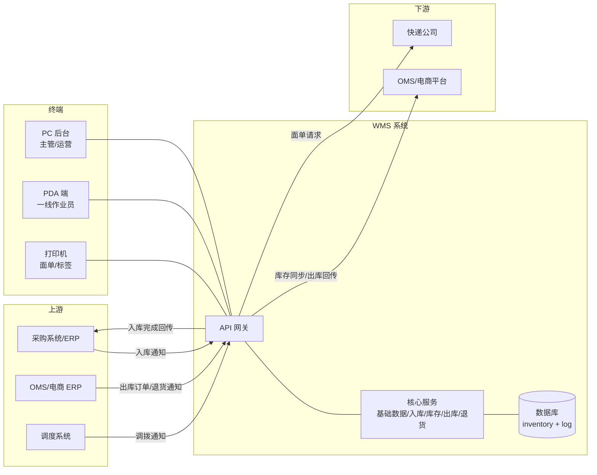
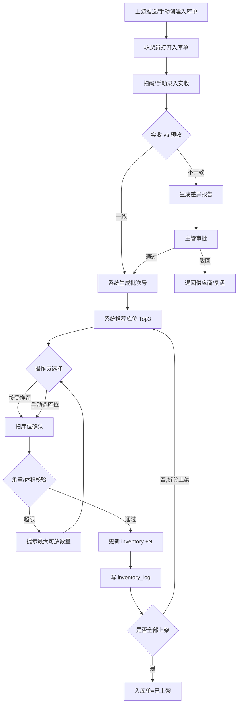
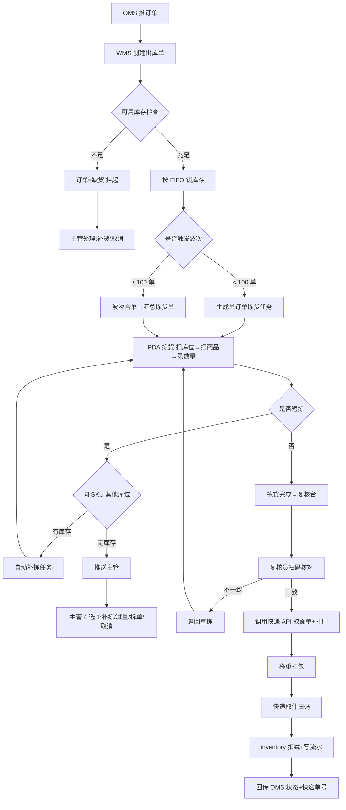
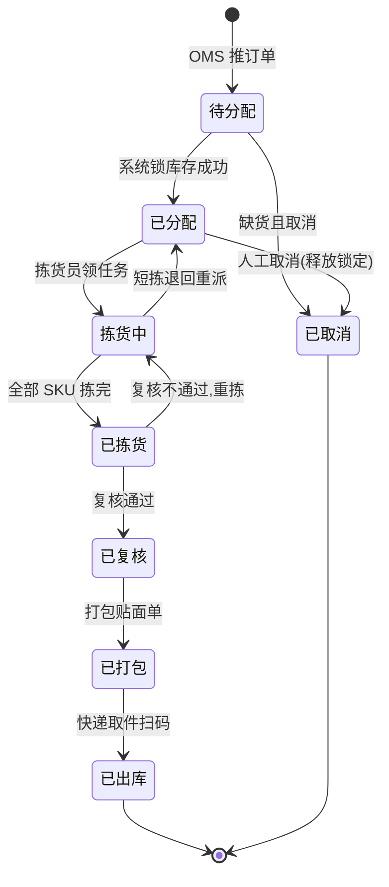
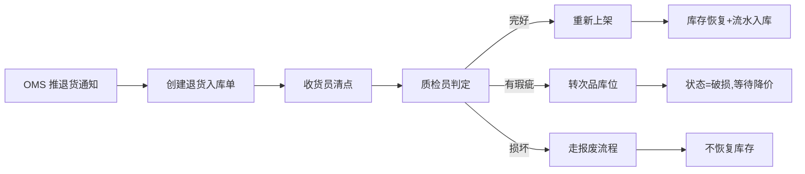
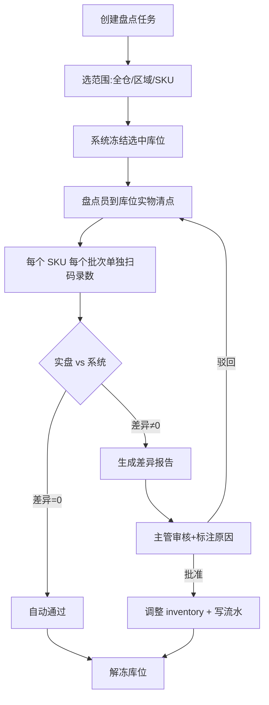
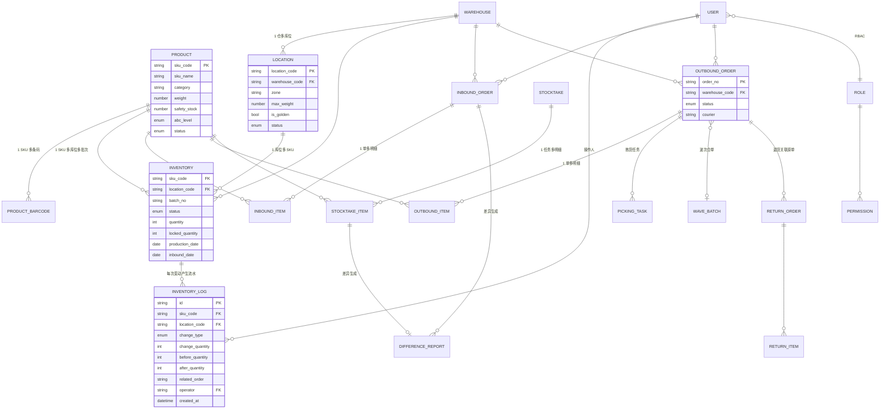

# WMS 仓库管理系统 产品需求文档 PRD v2.0

| 项目 | 内容 |
|---|---|
| 文档版本 | V2.0（结构化修订版） |
| 产品名称 | WMS 仓库管理系统（Warehouse Management System） |
| 文档状态 | 评审中 |
| 创建日期 | 2026-05-23 |
| 修订日期 | 2026-05-23 |
| 目标用户 | 仓库管理员、拣货员、运营人员 |
| 适用场景 | 电商备货型仓库 |

---

## 0. 执行摘要

为电商备货型仓库构建一套覆盖入库—库存—出库—退货全链路的 WMS 系统,解决当前**人工/Excel 管理下库存差异率约 8%、当日出库率不足 80%、拣货人效偏低**的核心问题。系统通过条码化作业、库位精细化管理、流水追溯和移动端化,目标在上线 6 个月内将库存准确率提升至 99.9%、当日出库率达 98%、拣货效率提升 50% 以上。分三期交付:**一期 8–10 周**跑通最小闭环(入库→库存→出库→PDA),二期 6–8 周补齐效率类功能(波次/盘点/退货/批次/报表),三期 8–12 周引入智能化(预警/调拨/补货/排班建议)。

---

## 1. 问题陈述

### 1.1 谁有这个痛点
- **仓库主管**:每天被库存数对不上、订单延迟出库追问淹没,周末加班盘库
- **运营/电商团队**:库存数据不准导致超卖或断货,客诉率高、平台扣分
- **老板/财务**:看不清在库金额、库龄、滞销品,资金周转效率低
- **一线作业员**(收货/拣货/复核):靠记忆和纸单,新人上手慢,出错被罚款

### 1.2 当前痛点(现状)
| 痛点 | 当前现状(待与现场确认) | 影响 |
|---|---|---|
| 库存不准 | 月度全盘差异率 ≈ 8%,每月需 2 人天处理差异 | 超卖赔付、采购决策失真 |
| 出库延迟 | 当日出库率 ≈ 75%,大促期间跌至 60% | 客诉、平台 DSR 下降 |
| 拣货低效 | 拣货平均 18 秒/件,新人上手需 2 周 | 人力成本高、爆仓时崩盘 |
| 异常无追溯 | Excel 记账,差异无法定位到人/时点 | 内部信任成本高 |
| 上下游脱节 | 库存靠人工导出回传 OMS,延迟 1–2 小时 | 平台库存超卖、补货滞后 |

> **数据说明**:以上为待与现场访谈/历史数据校验的初始假设,立项前需采集真实基线(见 [§5 成功指标])。

### 1.3 证据(待补充)
- [ ] 现场访谈 ≥ 5 位主管/作业员的痛点录音/纪要
- [ ] 近 3 个月盘点差异表
- [ ] 近 3 个月订单出库时间分布
- [ ] 近 3 个月客诉中"发货"相关占比

---

## 2. 目标用户与 Persona

### 2.1 Persona 一:仓库主管 老王
- **角色**:某华南仓主管,管 15 人作业团队
- **技能**:Excel 中级,不写代码;手机/微信熟练
- **目标**:库存准、按时出库、人少时不爆仓
- **痛点**:数据全靠下属手工录入,差异无法定位;大促临时招人培训慢
- **关键终端**:PC 后台(报表/审批)+ 手机(随时看进度)

### 2.2 Persona 二:拣货员 小李
- **角色**:25 岁,初中学历,入职 3 个月
- **技能**:智能手机熟练,不会用电脑
- **目标**:少走冤枉路,少被罚款,日清当日单
- **痛点**:库位编码记不住,经常找货 5–10 分钟;扫错商品被罚
- **关键终端**:PDA(全程一台设备完成所有操作)
- **设计含义**:PDA UI 必须**字大、按钮少、扫码即下一步**,不能要求多步骤选择

### 2.3 Persona 三:运营 周姐
- **角色**:电商运营,30 岁,本科
- **技能**:Excel 高级,数据看板
- **目标**:实时知道哪些 SKU 缺货、哪些滞销、库存能撑几天
- **痛点**:库存数据滞后,补货决策靠拍脑袋
- **关键终端**:PC 后台(报表为主)

### 2.4 角色与终端汇总
| 角色 | 主要职责 | 主要终端 |
|---|---|---|
| 系统管理员 | 基础数据、权限、系统设置 | PC 后台 |
| 仓库主管 | 波次策划、任务分配、异常审批、报表 | PC 后台 + 手机 |
| 收货员 | 到货收货、清点上架 | PDA |
| 拣货员 | 按任务到库位拣货 | PDA |
| 复核员 | 复核拣货、打包贴面单 | PDA + 打印机 |
| 运营 | 库存汇总、库龄、出入库统计 | PC 后台 |

---

## 3. 战略上下文

### 3.1 为什么是现在(Why Now)
- **业务驱动**:2026 Q2 公司启用第二个 800㎡ 仓库,人工管理已无法扩展
- **客户驱动**:近 3 个月平台 DSR 评分下降 0.3,核心扣分项为"发货速度"
- **技术驱动**:旧 Excel 方案已无法支撑日 500+ 订单峰值
- **政策驱动**:平台开始强制要求库存数据每 30 分钟回传一次

### 3.2 业务目标(对齐公司 OKR)
- **公司 OKR(2026 H2)**:将客户复购率从 18% 提升至 25%、运营毛利率从 12% 提升至 15%
- **本项目支撑**:通过提升出库准时率与库存准确性,降低客诉与超卖,直接支撑复购率;通过人效提升降低人力成本占比,支撑毛利率

### 3.3 竞品/替代方案选择说明
| 选项 | 评估结论 |
|---|---|
| 直接采购旺店通/万里牛 WMS | 标准化高,但库位策略、ABC 分类、波次规则无法贴合自有 SOP |
| 继续 Excel+人工 | 已不可扩展,二仓启用后必崩 |
| **自建(本方案)** | 中期成本可控,可深度集成自有 OMS,数据资产沉淀 |

### 3.4 系统边界(In / Out of Scope)
**In Scope**:仓库内部全部作业 + 与上下游系统的接口对接
**Out of Scope**:
- 订单管理(OMS):订单接入、快递分配由上游 OMS 完成
- 运输管理(TMS):快递对接、物流追踪在 WMS 之外
- 采购管理:采购决策、供应商管理由采购系统负责

WMS 通过 API 与上下游对接,接收入库通知与出库订单,回传库存与出库状态。

---

## 4. 解决方案概览

### 4.1 总体架构

### 4.2 核心模块清单
| 模块 | 子模块 | 上线阶段 |
|---|---|---|
| 基础数据 | 商品、仓库、库位、条码 | 一期 |
| 入库 | 入库单、收货、上架、批次 | 一期 |
| 库存 | 库存表、流水表、查询、移库 | 一期 |
| 出库 | 订单、库存锁定、拣货、复核、出库 | 一期 |
| 移动端 | 收货/上架/拣货/复核 PDA | 一期 |
| 高级出库 | 波次、播种式拣货 | 二期 |
| 盘点 | 全盘/区域/抽盘/异动盘 | 二期 |
| 退货 | 退货入库、质检分流 | 二期 |
| 报表 | 8 类核心报表 | 二期 |
| 预警/智能 | 安全库存、调拨、补货 | 三期 |

### 4.3 核心业务流程图

#### 4.3.1 入库主流程

#### 4.3.2 出库主流程(含短拣异常分支)

#### 4.3.3 出库单状态机

#### 4.3.4 退货质检分流

#### 4.3.5 盘点流程

> **说明**:
> 1. 已锁定但未出库的订单**不受盘点冻结影响**(锁定库存独立计算)
> 2. 图中"主管"角色操作均在 PC 后台完成,作业员均在 PDA 完成

---

## 5. 成功指标

### 5.1 主指标(必须达到)
| 指标 | 基线(待测) | 目标 | 度量方式 | 度量周期 |
|---|---|---|---|---|
| 库存准确率 | ~92% | ≥ 99.9% | 月度全盘差异 SKU 数 / 总 SKU 数 | 月 |
| 当日出库率 | ~75% | ≥ 98% | 当日订单中当日出库订单数 / 当日订单数 | 日 |
| 拣货人效 | ~18 s/件 | ≤ 9 s/件 | 拣货时长 ÷ 拣货件数 | 周 |

### 5.2 副指标(关注但不优化)
| 指标 | 目标 | 度量方式 |
|---|---|---|
| 库存差异可追溯率 | 100% | 任意差异可在流水表定位到操作人+时点 |
| 库存数据同步延迟 | ≤ 3 s | 库存变动到 OMS 收到回传的时差 |
| 新人 PDA 上手时间 | ≤ 2 天 | 从入职到独立完成 100 单拣货的时间 |

### 5.3 护栏指标(不能恶化)
| 指标 | 红线 | 说明 |
|---|---|---|
| 系统可用性 | ≥ 99.9% | 年停机 ≤ 8.8 小时 |
| 超卖率 | = 0 | 一旦发生需在 24 h 内复盘 |
| PDA 操作误码率 | ≤ 0.1% | 扫错商品/库位的比例 |

### 5.4 度量方法说明
- **基线采集**:立项后第 1 周完成,需现场抽样 + 历史数据回溯
- **目标达成时点**:上线 6 个月后整体达成,上线 1/3/6 个月各做一次评估
- **数据来源**:WMS 自身流水 + 月度盘点 + OMS 订单数据

---

## 6. 详细需求

### 6.1 基础数据管理

#### 6.1.1 商品管理(SKU)
**数据结构**

| 字段 | 类型 | 必填 | 说明 |
|---|---|---|---|
| sku_code | string | ✓ | SKU 编码,全局唯一,如 SKU-001 |
| sku_name | string | ✓ | 商品名称 |
| category | string | ✓ | 类目分类 |
| unit | string | ✓ | 计量单位 |
| spec | string | | 规格描述 |
| weight | number | ✓ | 单件重量(kg),库位承重校验用 |
| volume | number | | 单件体积(m³) |
| price | number | | 参考价格(元) |
| shelf_life_days | int | | 保质期天数,0 = 无保质期管理 |
| abc_level | enum | | A/B/C,系统每周自动计算 |
| **safety_stock** | int | | **安全库存,触发低库存预警(新增字段)** |
| **golden_location_priority** | bool | | **是否参与黄金库位推荐(新增字段)** |
| status | enum | ✓ | 启用 / 停用 |
| created_at / updated_at | datetime | ✓ | 时间戳 |

**条码管理**:一对多关系,sku_code + barcode + barcode_type(单品码/箱码/内部码)。无条码商品入库前必须由系统生成内部码并打印标签。

**功能要求**
- 单个新增 + Excel 批量导入
- 按名称/编码/类目搜索筛选
- 启用/停用(停用后不可用于新业务)
- 编码不可修改

#### 6.1.2 仓库管理
| 字段 | 必填 | 说明 |
|---|---|---|
| warehouse_code | ✓ | 仓库编码 |
| warehouse_name | ✓ | 仓库名称 |
| address | ✓ | 地址 |
| contact / phone | | 联系人/电话 |
| status | ✓ | 启用 / 停用 |

#### 6.1.3 库位管理
**数据结构**

| 字段 | 必填 | 说明 |
|---|---|---|
| location_code | ✓ | 格式:区域-货架-层,如 A-01-03 |
| warehouse_code | ✓ | 所属仓库 |
| zone | ✓ | 区域 |
| rack | ✓ | 货架号 |
| level | ✓ | 层号 |
| location_type | ✓ | 存储位 / 拣货位 / 暂存位 / 退货位 / 残次位 |
| max_weight | ✓ | 承重上限(kg) |
| max_volume | | 体积上限(m³) |
| **is_golden** | | **是否黄金库位(距打包台近+第 2-3 层,新增字段)** |
| status | ✓ | 空闲 / 占用 / 锁定 / 禁用 |

**功能要求**
- 按规则批量生成(如 A 区 3 排 5 层 → 自动生成 15 个库位)
- 启用/禁用
- 库位编码不可修改
- 实时显示占用情况(已用承重/体积、存放商品列表)

### 6.2 入库管理

入库类型:**采购入库 / 退货入库 / 调拨入库 / 期初导入**

**关键流程**(详见 [§7 用户故事])
1. 创建入库单(上游推送或手动)
2. 收货清点:扫码录入实收,系统比对预期,差异生成报告
3. 系统自动生成仓库批次号(BYYYYMMDD)+ 可录入供应商批次号
4. 上架:系统推荐库位 → 接受或手动选 → 支持拆分上架
5. 库位校验:承重/体积超限直接拒绝并提示最大可放数量

**库位推荐打分规则**(可配置)
| 优先级 | 规则 | 默认分值 | 备注 |
|---|---|---|---|
| 1 | 已有同 SKU 的库位 | +40 | 减少 SKU 分散 |
| 2 | 距打包台近的库位 | +30 | A 类商品权重 ×1.5 |
| 3 | 黄金层高(第 2-3 层) | +20 | 拣货效率最高 |
| 4 | 空间利用率高的库位 | +10 | 优先填满 |

**硬性筛选**:库位启用 + 承重/体积未超限 + 类目不冲突 + 库位类型匹配,不满足直接排除。

### 6.3 库存管理

#### 6.3.1 核心数据模型
**库存表 inventory**
- **唯一约束**:`(sku_code, location_code, batch_no, status)` 四元组唯一
- 字段:sku/库位/仓库/批次/供应商批次/数量/锁定数量/状态(正常/冻结/待检/破损)/生产日期/入库日期/更新时间

**库存流水表 inventory_log**(只追加,不修改不删除)
- 变动类型:入库 / 出库 / 移库出 / 移库入 / 盘盈 / 盘亏 / 冻结 / 解冻 / 锁定 / 释放
- 必含:before_quantity / after_quantity / 关联单号 / 操作人 / 操作时间

**整体 ER 图(核心表关系)**

> **图例说明**:
> - `INVENTORY` 是核心事实表,联合主键 = `sku_code + location_code + batch_no + status`
> - `INVENTORY_LOG` 是 append-only 流水,所有库存变动的唯一真相源
> - 未列详细字段的实体(DIFFERENCE_REPORT、PICKING_TASK、WAVE_BATCH、RETURN_ORDER、USER/ROLE/PERMISSION)详见各模块章节

#### 6.3.2 库存概念定义
| 概念 | 计算 | 用途 |
|---|---|---|
| 实物库存 | SUM(quantity) | 仓库实际有多少 |
| 可用库存 | SUM(quantity - locked_quantity), status=正常 | 可分配给订单 |
| 锁定库存 | SUM(locked_quantity) | 已分配未出库 |
| 在途库存 | 来自调拨/采购的在途数量 | 已发未到 |
| 不可用库存 | status ∈ {冻结/待检/破损} | 需处理后可用 |

#### 6.3.3 盘点
四类:全盘 / 区域盘 / 动态抽盘 / 异动盘。
**关键约束**:盘点期间冻结的库位,已锁定但未出库的订单**不受影响可继续出库**(锁定库存独立计算)。
流程:创建任务 → 冻结库位 → 实物清点(每个 SKU 每个批次单独盘) → 差异比对 → 主管审核 → 调整库存+流水。

#### 6.3.4 ABC 分类
- 每周根据最近 30 天出库频次自动计算
- A 类(0~80%) / B 类(80~95%) / C 类(95~100%)
- 新品默认 B 类,两周后重新计算
- 写入商品表 abc_level,库位推荐策略读取

### 6.4 出库管理

**出库类型**:销售出库 / 报废出库 / 调拨出库

**关键流程**:订单接入 → 库存分配锁定 → (波次策划) → 拣货 → 复核打包 → 出库交接

**库存分配规则**
- **FIFO 优先级**:有保质期商品按 `production_date` 升序;无保质期商品按 `inbound_date` 升序
- 同优先级时按库位推荐分值倒序
- 库存不足:订单标记缺货,挂起等待补货或人工处理

**拣货策略**
| 策略 | 适用场景 | 触发条件 |
|---|---|---|
| 摘果式 | 日单量 < 100、SKU 多 | 一期默认 |
| 播种式 | 日单量 ≥ 500、SKU 集中 | 二期 |
| **波次启用阈值** | 日单量 ≥ 100 | **可配置,默认 100** |

**短拣处理**(异常分支,需在 PDA 上 1 步操作)
| 处理方式 | 触发条件 | 决策者 |
|---|---|---|
| 自动从其他库位补拣 | 同 SKU 其他库位有库存 | 系统自动 |
| 减量发货 | 已与客户确认 | 主管 |
| 订单拆分 | 多 SKU 订单中部分短缺 | 主管 |
| 订单取消 | 全单短缺且无补货 | 主管 |

**出库单状态流转**:待分配 → 已分配 → 拣货中 → 已拣货 → 已复核 → 已打包 → 已出库 / 已取消

### 6.5 退货管理
OMS 推送退货通知 → 退货入库单(关联原出库订单号) → 收货清点 → 质检:
- **完好**:重新上架,库存恢复(流水 change_type=入库, remark=退货)
- **有瑕疵**:转入次品区,状态=破损,降价处理
- **损坏**:报废,不恢复库存

### 6.6 报表与数据分析

| 报表 | 核心指标 | 频率 | 使用者 |
|---|---|---|---|
| 库存报表 | 各 SKU 库存、可用量、分布库位 | 日 | 运营/主管 |
| 出入库统计 | 入库量、出库量、按 SKU/类目汇总 | 日 | 运营/主管 |
| 库龄分析 | 0–30 / 30–60 / 60–90 / 90+ 天分布 | 周 | 运营 |
| 库存周转率 | 销售成本 / 平均库存金额 | 月 | 运营/管理层 |
| 拣货效率 | 每人每小时件数、平均拣货时长 | 日 | 主管 |
| 盘点差异 | 差异率、差异金额、原因分布 | 盘点后 | 主管 |
| 操作日志 | 全量操作流水,可筛选 | 随时 | 管理员 |
| 库存预警 | 低于安全库存的 SKU、即将过期的 SKU | 实时 | 运营/采购 |

**预警规则**
| 类型 | 触发条件 | 通知方式 |
|---|---|---|
| 低库存预警 | 可用库存 < safety_stock | 站内消息 + 邮件 |
| 滞销预警 | 库龄 > 90 天且无出库 | 报表标红 |
| 保质期预警 | 距过期 < 30 天 | 站内消息 + 报表标红 |
| 库位超容预警 | 承重/体积使用率 > 90% | 站内消息 |

### 6.7 系统接口

**上游(WMS 接收)**:入库通知 / 出库订单 / 退货通知 / 调拨通知
**下游(WMS 输出)**:库存同步 / 出库回传 / 面单获取 / 入库完成回传

详细接口字段、调用频率、错误码见 [接口设计文档](待补充)。

### 6.8 非功能需求

#### 性能
| 指标 | 要求 | 依据 |
|---|---|---|
| 库存查询响应 | < 500 ms | OMS 实时查库存,客户感知 |
| 出库单处理能力 | 峰值 100+ 单/分钟 | 大促日均 1.5 万单 ÷ 8h 峰值 |
| 库存锁定并发 | 同 SKU 200+ 并发不超卖 | 大促秒杀场景 |
| 页面加载 | PC < 2 s, PDA < 3 s | 行业基准 |
| 数据同步延迟 | 库存变动 → 上游 ≤ 3 s | 平台 30 分钟回传要求倒推 |

#### 安全
- RBAC 角色权限,不同角色不同数据可见性
- 全量审计日志,不可篡改(append-only)
- 库存调整(盘盈盘亏)走审批流
- HTTPS 加密传输
- 每日自动备份,支持数据恢复

#### 可用性
- 系统可用性 ≥ 99.9%(年停机 ≤ 8.8 h)
- **PDA 离线模式**:网络断开时本地缓存最近 8 小时任务,恢复后按时间戳合并;冲突时以服务端为准并提示人工复核
- 大促弹性扩容

---

## 7. 用户故事与验收标准

> 本章只覆盖一期(P0)的核心故事,二期/三期在对应迭代规划补充。

### 7.1 基础数据

**US-01 批量导入商品**
作为系统管理员,我希望通过 Excel 一次导入数百个 SKU,以便快速完成基础数据初始化。
**AC**:
- [ ] 提供下载模板,模板含必填字段说明
- [ ] 上传后预览,标红错误行(编码重复/必填缺失/格式错误)
- [ ] 只导入校验通过的行,失败行下载导出
- [ ] 导入完成显示成功/失败计数

**US-02 批量生成库位**
作为系统管理员,我希望按"区域+排数+层数"规则一键生成库位,以避免手工录入数百条。
**AC**:
- [ ] 选择仓库 → 输入区域+排数+层数 → 预览将生成的库位列表
- [ ] 确认后批量写入,失败的逐条提示原因
- [ ] 生成后可单独编辑承重等属性

### 7.2 入库

**US-03 扫码收货**
作为收货员,我希望扫一次商品码数量自动+1,实时看到已收/预收数量,以便不抬头看入库单。
**AC**:
- [ ] PDA 顶部进度条显示"已收 X / 预收 Y"
- [ ] 扫商品码后数量+1 并播报"叮"
- [ ] 已收 > 预收时,弹红色提示"超出预收 N,是否继续"
- [ ] 扫到不在本单的 SKU,提示"非本单商品,是否新增"
- [ ] 支持长按数量手动改

**US-04 收货差异处理**
作为主管,我希望收货差异自动生成报告并推送给我审批,以便不漏处理。
**AC**:
- [ ] 收货完成且数量不一致 → 自动生成差异单
- [ ] 差异单推送到我的"待办"列表
- [ ] 我可标注差异原因(供应商少发/破损/多发等)
- [ ] 审批通过后,入库单按实收数量继续流转上架

**US-05 推荐库位上架**
作为收货员,我希望 PDA 自动推荐上架库位,以减少决策时间。
**AC**:
- [ ] 选商品后 PDA 显示推荐库位 Top 3,带分值与理由
- [ ] 默认选第 1 个,我可一键确认
- [ ] 也可手动扫描其他库位码覆盖推荐
- [ ] 库位承重/体积不足时,系统拒绝并显示该库位最大可放数量
- [ ] 支持本批次拆分多次上架到不同库位

### 7.3 库存

**US-06 库存汇总查询(运营视角)**
作为运营,我希望按 SKU 看到总库存、可用、锁定与库位分布,以便回答"还有多少能卖"。
**AC**:
- [ ] 列表展示 sku_code / sku_name / 实物 / 可用 / 锁定 / 库位数
- [ ] 点击 SKU 行展开,显示每条库存明细(库位+批次+数量+状态)
- [ ] 支持按编码/名称/类目搜索

**US-07 移库**
作为仓库员,我希望快速完成商品的库位转移并自动生成两条流水,以便备战大促时调整库位布局。
**AC**:
- [ ] PDA 流程:扫原库位 → 扫商品 → 输数量 → 扫目标库位 → 确认
- [ ] 系统校验目标库位承重/体积/类目
- [ ] 成功后生成两条流水:原库位"移库出 -N"+ 目标库位"移库入 +N",同一 transaction_id 关联

### 7.4 出库

**US-08 订单库存锁定**
作为系统,我希望接到 OMS 订单后立刻锁库存,以避免超卖。
**AC**:
- [ ] 接收 OMS 订单后,按 FIFO 规则选批次
- [ ] 锁定成功:locked_quantity 增加,订单状态=已分配
- [ ] 锁定失败(库存不足):订单状态=缺货,挂起并通知主管
- [ ] 并发锁定 200+ 单同一 SKU 时,不超过实际可用库存

**US-09 PDA 摘果式拣货**
作为拣货员,我希望 PDA 按最短路径依次提示库位和商品,以减少走路时间。
**AC**:
- [ ] 任务展示该单所有 SKU,按推荐路径排序
- [ ] 到库位 → 扫库位码确认 → 扫商品码确认 → 输/确认数量
- [ ] 库位/商品扫错时声光提示,不进入下一步
- [ ] 完成全部 SKU 后,自动跳到复核台引导

**US-10 短拣异常**
作为拣货员,我希望发现短缺时一键上报,让主管决定,以避免我在原地等待。
**AC**:
- [ ] PDA "短拣"按钮,1 步提交实际可拣数量
- [ ] 系统检查同 SKU 其他库位是否有库存:
  - 有 → 自动生成补拣任务,引导我去新库位
  - 无 → 任务挂起,推送主管
- [ ] 主管 PC 端 4 选 1:补拣 / 减量 / 拆单 / 取消

**US-11 复核打包**
作为复核员,我希望扫码核对每件商品,以避免错发漏发。
**AC**:
- [ ] 扫商品码逐件核对,已核件数实时更新
- [ ] 多扫/少扫时声光提示且不允许结束
- [ ] 全部核对后,自动调用快递 API 取面单并触发打印
- [ ] 称重数据自动回填出库单

**US-12 出库交接扣减**
作为系统,我希望快递取件扫码后才扣减库存并回传 OMS,以保证账实一致。
**AC**:
- [ ] 快递员扫出库单条码,状态变"已出库"
- [ ] inventory.quantity 减少 + locked_quantity 减少
- [ ] 写入 inventory_log,change_type=出库
- [ ] 调用 OMS 回传接口,失败重试 3 次,最终失败进入人工队列

### 7.5 角色与权限

**US-13 RBAC 角色管理**
作为管理员,我希望按角色分配菜单与数据权限,以避免拣货员看到财务数据。
**AC**:
- [ ] 预置 6 个角色(管理员/主管/收货/拣货/复核/运营)
- [ ] 可新建角色并勾选菜单 + 数据范围(按仓库)
- [ ] 用户分配角色后,登录立即生效

---

## 8. 风险、依赖与开放问题

### 8.1 风险与缓解
| 编号 | 风险 | 概率 | 影响 | 缓解措施 |
|---|---|---|---|---|
| R1 | PDA 网络断开导致作业中断 | 中 | 高 | 一期实现本地缓存模式,断网可拣货,恢复后同步 |
| R2 | 并发场景下超卖 | 中 | 极高 | 库存锁定走分布式锁;护栏指标超卖率=0;每周自查 |
| R3 | 一线员工不会用 PDA | 高 | 中 | UI 极简化;每个 Persona 单独培训手册;上线前 3 天驻场支持 |
| R4 | 上下游 OMS 接口变更 | 中 | 高 | 接口签订 SLA;版本号管理;契约测试 |
| R5 | 基线数据采集不足导致目标失真 | 中 | 中 | 立项后第 1 周完成基线采集 |
| R6 | 旧 Excel 数据迁移错误 | 高 | 高 | 期初导入单独模块,支持试运行+回滚 |
| R7 | 历史批次/保质期数据缺失 | 高 | 中 | 期初导入允许批次号为"INIT-YYYYMMDD",后续逐步规范 |

### 8.2 依赖
| 依赖 | 所属方 | 时点 | 状态 |
|---|---|---|---|
| OMS 接口文档与联调环境 | OMS 团队 | 第 2 周 | 待启动 |
| 二仓硬件(PDA × 10、打印机 × 3) | IT/采购 | 第 4 周 | 待启动 |
| 快递公司电子面单 API 接入 | 商务 | 第 6 周 | 待启动 |
| 老仓库 SKU/库存基础数据 | 仓库主管 | 第 1 周 | 待启动 |

### 8.3 开放问题
| 编号 | 问题 | 待决策方 | 截止 |
|---|---|---|---|
| Q1 | FIFO 用 production_date 还是 inbound_date?当前方案为"有保质期用前者" | 运营 + 仓库 | 评审会 |
| Q2 | 波次启用阈值 100 单是硬规则还是可配置?当前方案为可配置 | 主管 | 评审会 |
| Q3 | 库位推荐分值 40/30/20/10 的权重需要 A/B 验证吗? | 运营 | 一期上线后 |
| Q4 | 盘点冻结期间已锁定订单的处理策略需确认 | 主管 | 评审会 |
| Q5 | 离线模式冲突解决策略:"服务端优先"是否会丢失现场数据? | 仓库 + 研发 | 一期设计阶段 |

---

## 9. 开发分期与退出标准

### 9.1 第一期:最小可用(8–10 周)
**目标**:跑通一单从入库到出库的完整闭环。
**范围**:基础数据 + 入库(含拆分上架) + 库存(表+流水+查询) + 出库(摘果式+复核+交接) + 移动端
**退出标准**(全部满足才进入二期):
- [ ] 单仓单日完成 ≥ 200 单出库 0 错误
- [ ] 库存数据与人工抽盘差异 ≤ 0.5%
- [ ] 当日出库率 ≥ 90%(目标 98% 留给二期优化)
- [ ] 一线作业员独立操作,无需研发驻场

### 9.2 第二期:效率提升(6–8 周)
**范围**:波次拣货 / 播种式 / 盘点 / 退货 / 批次管理 / 库位推荐 / 报表
**退出标准**:
- [ ] 大促单日 ≥ 1500 单 0 超卖
- [ ] 库存准确率 ≥ 99.9%
- [ ] 当日出库率 ≥ 98%
- [ ] 拣货人效较一期再提升 30%

### 9.3 第三期:智能化(8–12 周)
**范围**:存储→拣货补货 / 多仓调拨 / 库存预警 / 人效分析 / 安全库存自动计算
**退出标准**:
- [ ] 滞销/即将过期/低库存预警准确率 ≥ 95%
- [ ] 多仓调拨闭环可用
- [ ] 安全库存自动计算被运营采纳率 ≥ 70%

---

## 10. 术语表

| 术语 | 定义 |
|---|---|
| SKU | Stock Keeping Unit,商品最小可识别单元 |
| 批次 | 同一 SKU 同一次入库(同生产日期)的库存集合,有独立批次号 |
| 库位 | 仓库内的最小存储单元,如 A-01-03 |
| 黄金库位 | 距打包台近且第 2-3 层的库位,拣货效率最高 |
| 波次 | 把多张订单按规则合并为一组,生成一张汇总拣货单 |
| 摘果式 | 一人跟一单从头到尾拣完 |
| 播种式 | 先按 SKU 批量拣出,再回到分拣台分配给各订单 |
| FIFO | First In First Out,先入先出 |
| ABC 分类 | 按出货频次将 SKU 分为 A/B/C 三类,指导库位分配 |
| 安全库存 | 触发补货预警的库存下限 |
| RBAC | Role-Based Access Control,基于角色的访问控制 |
| 短拣 | 拣货时实际库存不足以满足任务的异常情况 |

---

## 附录:与 V1.0 的主要变更
1. **新增**:执行摘要、问题陈述(含证据待补)、Persona(3 个)、战略上下文、用户故事(13 个 P0)、风险/依赖/开放问题、术语表
2. **修订**:成功指标补"基线+度量方法+护栏指标";数据模型补 `safety_stock`、`golden_location_priority`、`is_golden` 字段;FIFO 规则明确;短拣处理决策矩阵化;离线冲突策略明确;分期补退出标准
3. **保留**:全部既有功能描述与数据结构未删除,仅做小幅润色与字段补充

— 文档结束 —
