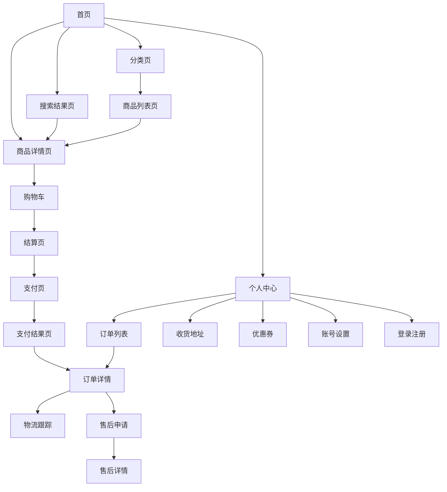
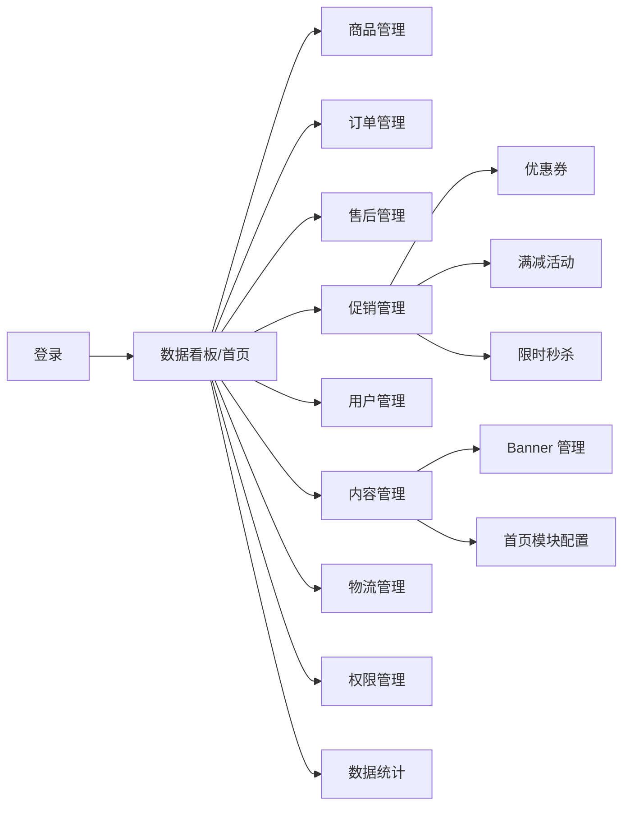
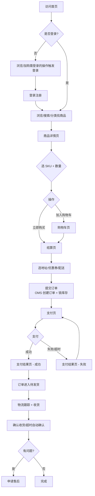
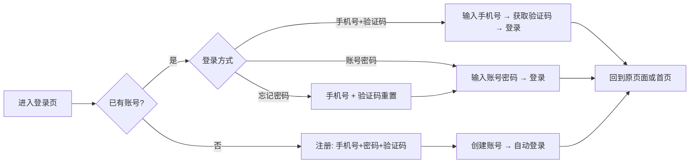
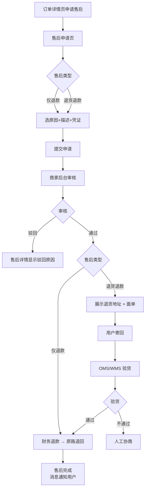
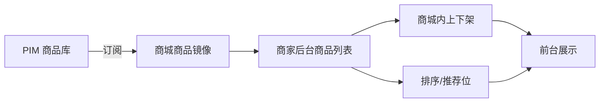
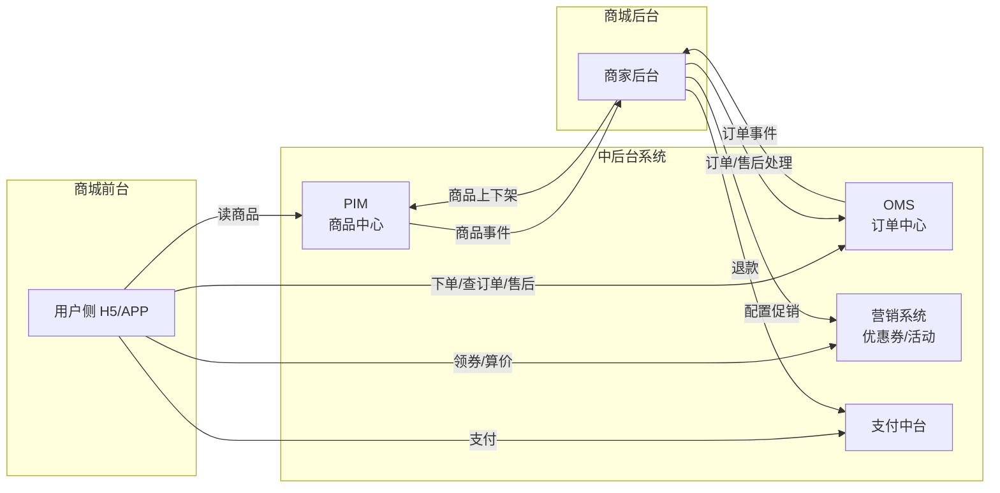

# 商城页面 PRD

| 项目 | 内容 |
|------|------|
| 文档版本 | v1.0 |
| 编写日期 | 2026-05-23 |
| 文档状态 | 草稿（待评审） |
| 关联文档 | [商城页面设计文档.md](./商城页面设计文档.md)、[../PIM/PIM-PRD.md](../PIM/PIM-PRD.md)、[../OMS/OMS-PRD.md](../OMS/OMS-PRD.md) |
| 目标读者 | 产品、设计、前端、后端、测试、运营 |

---

## 1. 项目背景与目标

### 1.1 背景
商城是公司面向 C 端的销售门面，也是商家运营的日常工作台。目前缺乏统一的页面规范与产品设计文档，导致：
- 用户购买路径长、跳转混乱、转化率偏低；
- 商品/订单/售后等数据分散在 PIM、OMS、支付系统，缺少前端整合层；
- 商家后台凭经验拼凑，权限和操作日志缺失；
- 促销、内容、运营动作无法落地到统一页面。

### 1.2 项目目标
通过本期商城建设：
1. **用户侧（前台）**：完成从浏览 → 下单 → 支付 → 售后的端到端闭环；核心购买路径 ≤ 5 步。
2. **商家侧（后台）**：覆盖商品、订单、售后、促销、内容、数据 6 大日常工作场景。
3. **系统打通**：商城作为 PIM / OMS / 支付 / 营销系统的"展示与操作层"，不重复造数据。
4. **可量化指标**：
   - 商品详情页 → 加购转化率 ≥ 8%
   - 加购 → 下单转化率 ≥ 40%
   - 下单 → 支付完成率 ≥ 85%
   - 首屏可交互时间（TTI）≤ 2s

### 1.3 非目标（Out of Scope）
- 商品基础信息维护（在 PIM）；
- 订单履约调度（在 OMS）；
- 支付通道实现（在支付中台）；
- 真正的 BI 分析（数据看板只做经营快照，深度分析在 BI）。

---

## 2. 用户角色

| 角色 | 平台 | 主要场景 |
|------|------|----------|
| 游客 | 用户侧 | 浏览首页、商品、搜索；下单需登录 |
| 注册用户 | 用户侧 | 浏览、下单、支付、售后、个人中心 |
| 超级管理员 | 商家后台 | 全部功能 + 权限分配 |
| 运营 | 商家后台 | 商品上下架、促销、内容 |
| 客服 | 商家后台 | 订单查询、售后处理 |
| 财务 | 商家后台 | 退款审批、销售报表 |

---

## 3. 信息架构（站点地图）

### 3.1 用户侧（前台）



### 3.2 商家侧（后台）



---

## 4. 核心用户旅程

### 4.1 端到端购买流程



### 4.2 注册登录流程



### 4.3 售后流程



---

## 5. 用户侧页面详述

> 通用规范：所有页面需具备 加载态 / 空态 / 错误态 / 网络异常态；所有写操作需有 loading + 成功/失败 toast。

### 5.1 登录 / 注册页

| 项 | 说明 |
|----|------|
| 入口 | 顶部"登录"按钮、需登录操作触发跳转 |
| 字段 | 手机号、密码、图形验证码、短信验证码 |
| 交互 | Tab 切换 登录 / 注册 / 忘记密码；验证码 60s 冷却 |
| 校验 | 手机号格式、密码强度（≥ 8 位含字母数字）、验证码 5 分钟有效 |
| 验收 | 错误提示明确（手机号未注册、密码错误、验证码错误） |

### 5.2 首页

| 区块 | 说明 |
|------|------|
| 顶部 | Logo + 搜索框 + 购物车角标 + 登录入口 |
| Banner | 轮播图（≤ 5 张，可配跳转） |
| 分类导航 | 一级类目快捷入口（图标 + 文字） |
| 推荐商品 | 后台手动 + 算法推荐混排 |
| 热销/新品 | 后台配置 / 销量自动排序 |
| 验收 | 首屏 TTI ≤ 2s；模块由内容管理后台动态配置 |

### 5.3 商品分类页

- 左侧一级类目列表 + 右侧二级 / 三级类目卡片；
- 类目数据来自 PIM；
- 点击三级类目进入"商品列表页"，带类目筛选参数。

### 5.4 商品列表页

| 区块 | 说明 |
|------|------|
| 筛选 | 价格区间、品牌（多选）、属性（多选） |
| 排序 | 综合（默认）、销量、价格升/降、上新时间 |
| 商品卡片 | 主图、名称、价格、销量；可显示促销标 |
| 分页 | 移动端无限滚动，桌面端分页 |
| 空态 | "暂无符合条件的商品" + 清除筛选按钮 |

### 5.5 搜索结果页

- 顶部搜索框 + 历史 + 热搜（最多 10 个）；
- 命中 → 同列表页结构；
- 无命中 → 推荐"猜你喜欢"。

### 5.6 商品详情页（核心页面）

#### 区块设计

| 区块 | 字段 / 交互 |
|------|------|
| 商品信息区 | 图片轮播（≥ 3 张）、视频（可选）、名称、副标题、划线价 + 促销价、库存提示 |
| SKU 选择区 | 销售属性按钮组；选中后实时更新价格、库存、主图 |
| 购买操作区 | 数量步进器、加入购物车、立即购买、收藏 |
| 详情区 | 富文本详情、参数表 |
| 推荐区 | 关联推荐商品 |

#### 关键交互流程

```mermaid
flowchart LR
    A[进入详情页] --> B[加载 PIM 商品数据]
    B --> C[展示默认 SKU 信息]
    C --> D[用户选择规格]
    D --> E{该 SKU 组合存在?}
    E -- 否 --> E1[置灰不可选]
    E -- 是 --> F[更新价格/库存/图片]
    F --> G{库存 > 0?}
    G -- 否 --> G1[按钮置灰<br/>显示"无货"]
    G -- 是 --> H[加购或立即购买]
```

#### 边界
- 商品已下架 → 整页不可下单，按钮置灰；
- 库存 = 0 → 显示"到货通知"按钮（可选 P1）；
- 限购数量 → 数量步进器锁定上限。

### 5.7 购物车页

| 项 | 说明 |
|----|------|
| 列表 | 商品图、名称、规格、单价、数量、小计、删除 |
| 选择 | 单选 + 全选；只对勾选商品结算 |
| 失效区 | 已下架/无货商品单独区域，不参与结算 |
| 优惠提示 | "再买 XX 元享满减" |
| 合计 | 仅勾选商品的总价 + 预估优惠 |
| 验收 | 加购后 1s 内可见；跨设备同步（登录用户） |

### 5.8 结算页

| 区块 | 说明 |
|------|------|
| 地址 | 默认地址置顶；点击切换/新增地址 |
| 商品清单 | 来自购物车或"立即购买" |
| 优惠 | 可用优惠券列表 + 自动选最优；满减提示 |
| 配送 | 普通快递 + 预计送达时间（来自 OMS 路由） |
| 费用 | 商品总价、运费、优惠减免、应付金额 |
| 操作 | 提交订单 → 调 OMS 创建订单 → 跳支付页 |
| 异常 | 提交时校验库存/价格变化，变化则中断并提示 |

### 5.9 支付页

| 项 | 说明 |
|----|------|
| 展示 | 订单号、应付金额、倒计时（默认 30 分钟） |
| 支付方式 | 微信支付、支付宝 |
| 交互 | 拉起对应支付 SDK，回调结果跳转支付结果页 |
| 异常 | 超时 → 跳支付失败页 + 重新支付入口 |

### 5.10 支付结果页

- 成功：显示订单号、金额、"查看订单" / "继续购物"；
- 失败：原因 + "重新支付" / "取消订单" / "联系客服"；
- 处理中：5s 自动轮询支付状态，最多 3 次。

### 5.11 订单列表页

- Tab：全部、待付款、待发货、待收货、已完成、售后；
- 卡片字段：商品缩略图、名称、规格、数量、实付、状态；
- 状态对应操作按钮：

| 状态 | 主要操作 |
|------|----------|
| 待付款 | 去支付、取消订单 |
| 待发货 | 查看详情、申请取消（部分场景） |
| 待收货 | 查看物流、确认收货 |
| 已完成 | 申请售后、再次购买、评价 |
| 售后中 | 查看售后详情 |

### 5.12 订单详情页

- 状态进度条（待付款 → 已支付 → 已发货 → 已完成）；
- 收货地址、商品信息、费用明细、物流入口；
- 操作按钮根据状态展示；
- 订单数据来自 OMS。

### 5.13 物流跟踪页

- 物流公司、快递单号（可复制）；
- 时间线倒序展示物流节点；
- 数据来自 OMS（OMS 又来自物流商）。

### 5.14 售后申请页

| 字段 | 说明 |
|------|------|
| 售后类型 | 仅退款 / 退货退款（根据订单状态可选） |
| 退款原因 | 下拉选择（如 商品质量问题、不想要了） |
| 描述 | 文本框，≤ 200 字 |
| 凭证 | 图片上传 ≤ 5 张 |
| 提交 | 调 OMS 售后接口 → 进入售后详情 |

### 5.15 售后详情页

- 进度时间线（已提交 → 审核中 → 通过/驳回 → 退款中 → 完成）；
- 退款金额、退款方式、原路退回提示；
- 操作记录 + 客服联系入口。

### 5.16 个人中心页

- 头像、昵称；
- 订单快捷入口（4 个状态）；
- 收货地址、优惠券、账号设置、退出登录。

### 5.17 收货地址管理页

- 列表 + 默认标识；
- 新增/编辑表单：姓名、手机号、省市区三级联动、详细地址、设为默认；
- 删除二次确认。

### 5.18 优惠券页

- Tab：未使用、已使用、已过期；
- 信息：面额、使用门槛、有效期；
- 输入券码领取（接营销系统）。

### 5.19 账号设置页

- 修改昵称、头像（上传图片）；
- 修改手机号（旧手机验证码 + 新手机验证码）；
- 修改密码（原密码 + 新密码 + 确认）。

---

## 6. 商家侧页面详述

### 6.1 登录页

- 账号密码登录；
- 失败 5 次锁定 10 分钟；
- 登录后根据角色加载菜单。

### 6.2 数据看板（首页）

| 区块 | 指标 |
|------|------|
| 今日卡片 | 销售额、订单量、访客数、转化率 |
| 趋势图 | 近 7 天 / 30 天 切换 |
| 待办 | 待发货订单数（点击跳订单管理）、售后待处理数 |

### 6.3 商品管理

- 商品列表数据**来自 PIM**（不在此处维护商品基础信息）；
- 商城内控制：上下架、排序权重、首页/分类页推荐位绑定；
- 筛选：类目、品牌、状态、是否在售；
- 操作：批量上下架、单品调整排序权重。



### 6.4 订单管理

- 列表 + 搜索（订单号、手机号、商品名）；
- 详情查看；
- "推送至 OMS"按钮：异常订单可手动重推；
- 备注：仅供后台查看，不展示给客户；
- 订单数据来自 OMS。

### 6.5 售后管理

- 列表：待审核、处理中、已完成、已驳回；
- 详情：用户信息、订单、售后类型、原因、凭证；
- 审核操作：通过 / 驳回（驳回需填原因）；
- 退款操作：调 OMS / 支付中台执行；
- 全程操作留痕。

### 6.6 促销管理

#### 6.6.1 优惠券

| 字段 | 说明 |
|------|------|
| 类型 | 满减券 / 折扣券 / 无门槛券 |
| 面额 | 数字 |
| 门槛 | 满 X 元可用 |
| 有效期 | 起止时间 |
| 数量 | 发放总量、每人限领数 |
| 发放方式 | 用户领取 / 系统定向发放 |

#### 6.6.2 满减活动

- 满 X 减 Y；
- 时间范围；
- 关联指定商品/类目/全场；
- 与优惠券叠加规则可配置。

#### 6.6.3 限时秒杀

```mermaid
flowchart TD
    A[新建秒杀活动] --> B[选商品 + 设置秒杀价/库存]
    B --> C[设置开始/结束时间]
    C --> D[保存活动]
    D --> E{到达开始时间}
    E -- 是 --> F[前台展示秒杀价 + 倒计时]
    F --> G[用户下单走秒杀价]
    G --> H[秒杀库存独立扣减]
    H --> I{秒杀库存=0?}
    I -- 是 --> I1[按钮置灰显示"已抢光"]
    I -- 否 --> F
    E -- 结束 --> J[恢复原价]
```

### 6.7 用户管理

- 列表 + 搜索（手机号）；
- 详情：基本信息 + 订单 + 消费金额；
- 不可手动新增/删除用户（用户由注册产生）。

### 6.8 内容管理

#### 6.8.1 Banner

- 上传图片、配置跳转链接（商品/活动页/分类页）；
- 排序 + 上下线；
- 配置展示位置（首页 / 分类页等）。

#### 6.8.2 首页模块

- 推荐位：手动添加/移除商品；
- 热销位：按销量自动 + 手动置顶；
- 新品位：自动关联 PIM 最新上架。

### 6.9 物流管理

- 维护合作物流公司列表；
- 运费模板：按地区 + 重量分段；
- 包邮条件：金额满 X 包邮 / 指定地区包邮；
- 数据共享给 OMS 用于结算页运费计算。

### 6.10 权限管理

- 角色：超级管理员、运营、客服、财务；
- 菜单 + 按钮级权限；
- 操作员账号管理；
- 操作日志（谁、何时、做了什么）。

### 6.11 数据统计

- 销售报表：按日 / 周 / 月；
- 商品销售排行；
- 用户增长趋势；
- 订单转化漏斗（访问 → 加购 → 下单 → 支付）；
- 一键导出 Excel。

---

## 7. 与上下游系统的关系



**职责边界：**
- 商城页面是"展示层 + 操作层"，**不存"主数据"**；
- 商品、订单、库存、促销、支付的主数据分别在对应中后台系统；
- 商城后台的"商品管理"只是 PIM 数据的本地化操作视图。

---

## 8. 通用设计规范

### 8.1 状态规范
所有数据展示页都需具备：
- **加载态**（骨架屏 / loading）
- **空态**（图片 + 文案 + 引导按钮）
- **错误态**（错误码 + 重试）
- **网络异常态**（断网提示）

### 8.2 交互规范
- 写操作必须有 loading + 结果 toast；
- 不可逆操作（删除、退款）需二次确认；
- 表单实时校验，提交前总校验。

### 8.3 响应式
- 用户侧：H5 优先，兼容主流移动端 + PC；
- 后台：1280+ 桌面为主，最低支持 1024。

### 8.4 国际化（预留）
- 文案抽离至语言包；
- 首版只做中文，但接口设计预留 locale 参数。

---

## 9. 非功能性需求

| 类别 | 指标 |
|------|------|
| 性能 | 首屏 TTI ≤ 2s；商品详情页加载 ≤ 1.5s；接口 P95 < 500ms |
| 兼容 | iOS 14+、Android 8+、Chrome/Safari/Firefox 近两年版本 |
| 可用 | 用户侧 ≥ 99.9%，后台 ≥ 99.5% |
| 安全 | 防 XSS / CSRF / SQL 注入；敏感字段脱敏；接口签名 + 限流 |
| 埋点 | PV/UV、加购、下单、支付转化全埋点 |
| 可观测 | 前端错误监控 + 接口耗时监控 |

---

## 10. 关键数据埋点

| 事件 | 触发 | 用途 |
|------|------|------|
| page_view | 进入页面 | PV/UV |
| product_view | 商品详情曝光 | 商品热度 |
| add_to_cart | 加购 | 加购转化率 |
| checkout_start | 进入结算页 | 加购→下单转化率 |
| order_submit | 提交订单 | 下单转化率 |
| pay_success | 支付成功 | 支付完成率 |
| pay_fail | 支付失败 | 失败原因分析 |
| aftersale_apply | 售后申请 | 售后率 |

---

## 11. 上线节奏（建议）

| 阶段 | 范围 | 周期 |
|------|------|------|
| M1（用户侧 MVP） | 登录、首页、分类、列表、详情、购物车、结算、支付、订单列表/详情 | 8 周 |
| M2（后台 MVP） | 后台登录、数据看板、商品管理、订单管理 | 5 周 |
| M3（售后闭环） | 售后申请/详情、后台售后管理、物流跟踪 | 4 周 |
| M4（营销） | 优惠券、满减、秒杀、Banner、首页模块配置 | 5 周 |
| M5（增强） | 用户管理、数据统计、权限、账号设置 | 4 周 |

---

## 12. 验收标准（总体）

1. 用户侧核心购买路径（首页 → 详情 → 加购 → 结算 → 支付 → 完成）可走通；
2. 商家后台可完成日常商品/订单/售后/促销/内容操作；
3. 与 PIM / OMS / 营销 / 支付 各系统对接正常，数据一致；
4. 转化率、性能指标达到第 1.2 / 第 9 节要求；
5. 全量页面具备加载/空/错/异常四态；
6. 关键事件埋点 100% 覆盖；
7. 权限隔离 + 操作日志可追溯。

---

## 13. 风险与依赖

| 风险/依赖 | 影响 | 缓解措施 |
|-----------|------|----------|
| PIM/OMS/营销系统未就绪 | 商城无法上线 | 各系统排期对齐 + Mock 联调 |
| 支付通道变更 | 支付失败 | 支付中台抽象，渠道可切换 |
| 营销逻辑复杂 | 算价错误 | 价格计算交营销中台统一计算 |
| 大促流量 | 详情页/结算页崩 | CDN + 缓存 + 限流 + 压测 |
| 用户跨端数据同步 | 购物车不同步 | 登录后云端同步 + 离线合并策略 |

---

*文档基于 [商城页面设计文档.md](./商城页面设计文档.md) 落地，覆盖用户侧 19 个页面、商家侧 11 个模块的需求、信息架构、用户旅程、系统对接与上线节奏。*
