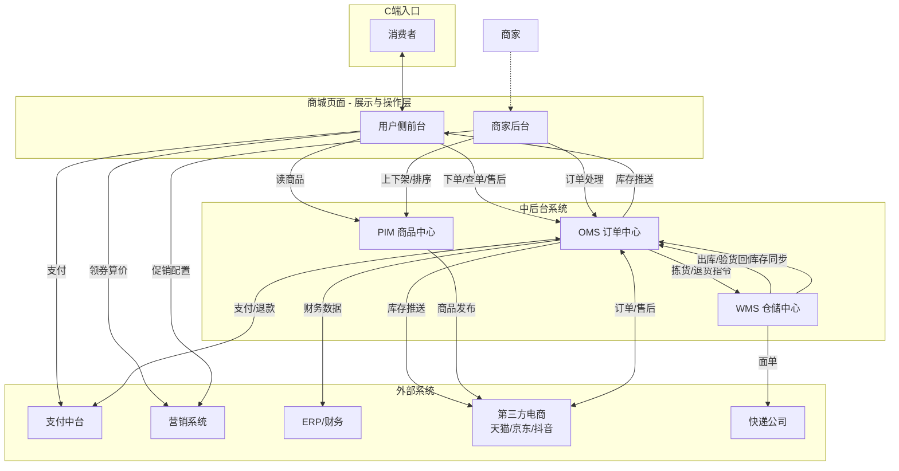
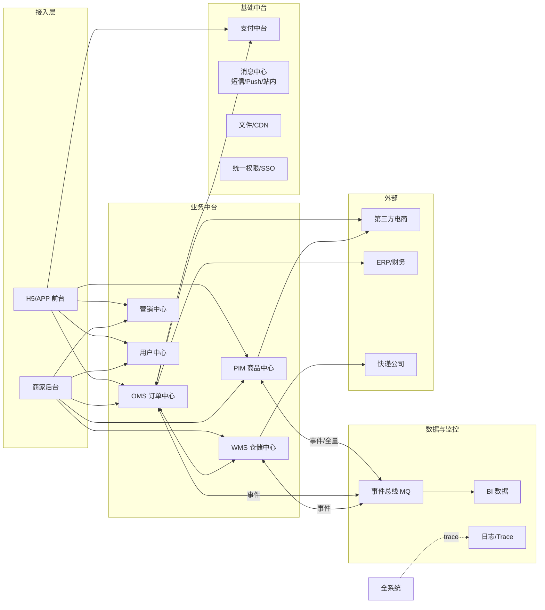
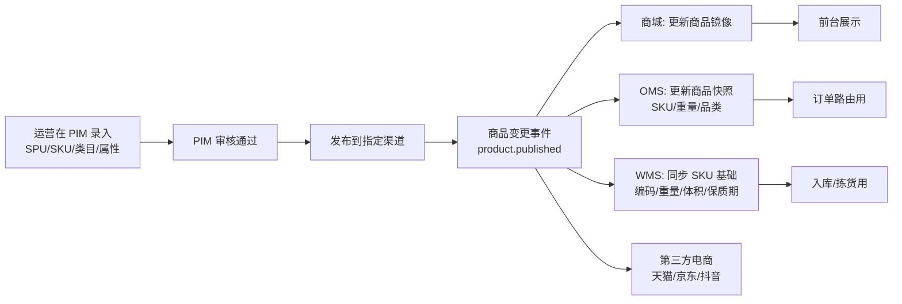
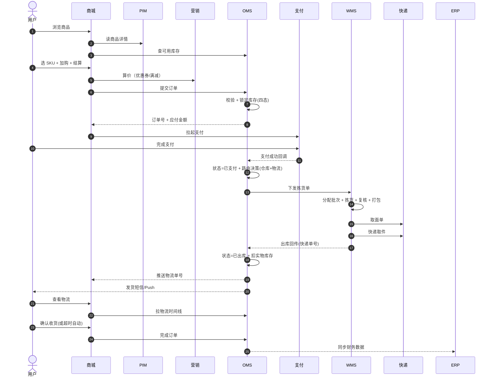
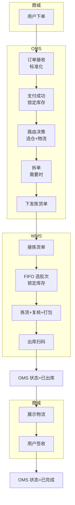
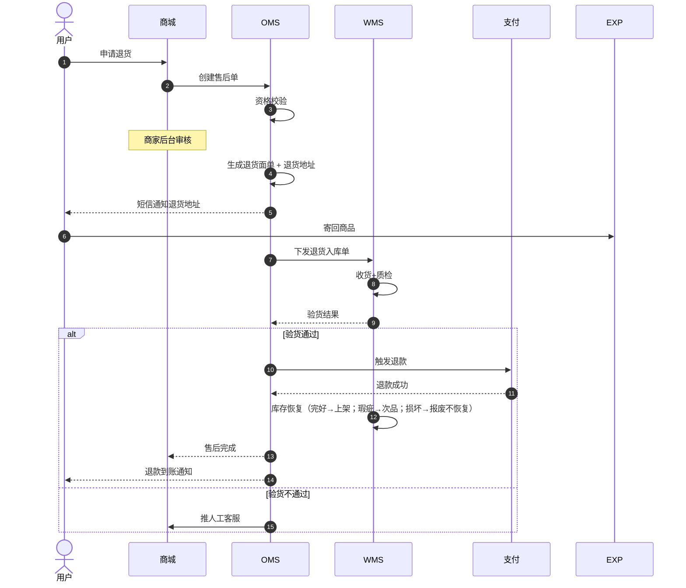
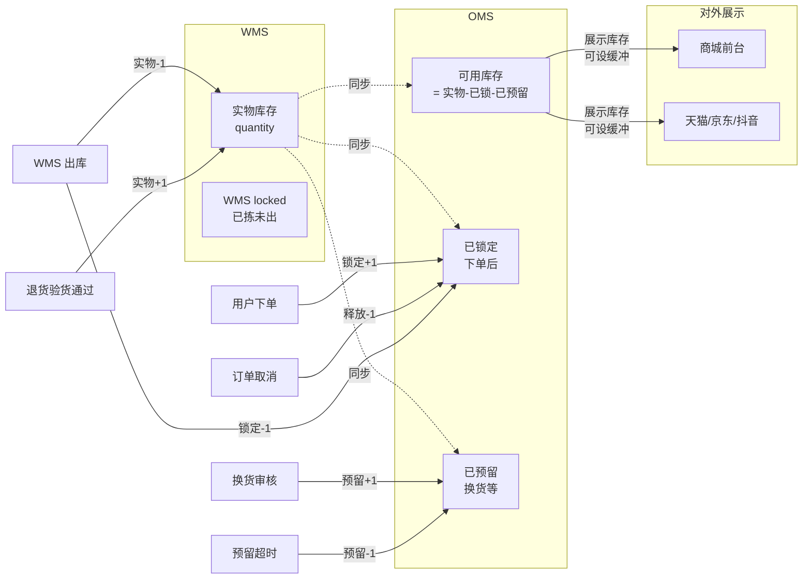
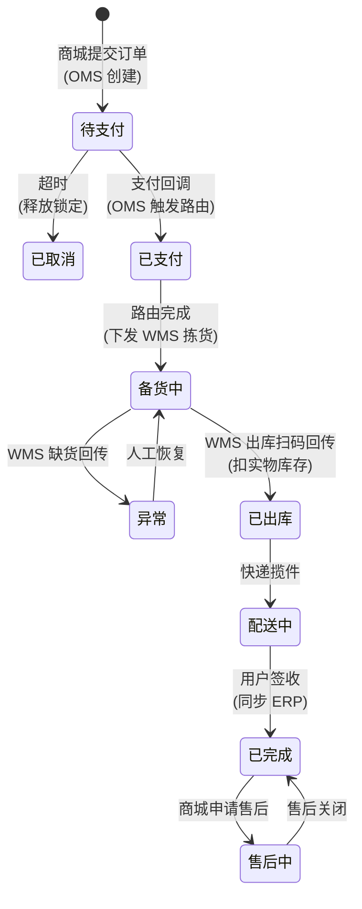
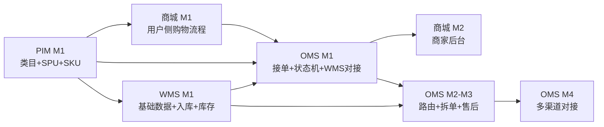

# 电商系统整体架构与协同手册

> 把 **商城页面 / PIM / OMS / WMS** 四个系统串起来，明确各自边界、数据流向、端到端业务协同与上线策略。

| 项目 | 内容 |
|------|------|
| 文档版本 | v1.0 |
| 编写日期 | 2026-05-23 |
| 文档状态 | 草稿（待评审） |
| 关联文档 | [商城页面-PRD.md](./商城页面/商城页面-PRD.md)、[PIM-PRD.md](./PIM/PIM-PRD.md)、[OMS-PRD.md](./OMS/OMS-PRD.md)、[WMS_PRD_v2.md](./wms/WMS_PRD_v2.md) |
| 目标读者 | 产品、研发、测试、运营、商家、仓储、客服 |

---

## 1. 为什么需要这份文档

四个系统各自都已有独立 PRD，但跨系统的协同问题不在任何一份里：
- 用户在商城下单后，订单/库存/履约状态怎么在四个系统之间流转？
- 商品是 PIM 维护还是商城后台维护？库存是 WMS 还是 OMS 的"真相源"？
- 售后退款触发后，钱、货、库存、订单状态分别在哪里联动？
- 上线时谁先谁后？没有上下游的中间系统能不能独立验收？

本文档定义：**边界、数据所有权、端到端流程、接口契约、上线节奏**。

---

## 2. 四个系统的定位与边界

| 系统 | 一句话定位 | 核心职责 | 非职责（交给谁） |
|------|-----------|---------|----------------|
| **商城页面** | 用户的"门面" + 商家的"工作台" | 展示商品、收集下单意图、商家日常操作 | 不存主数据，所有数据从下游系统拿 |
| **PIM** | 商品的"档案库" | 类目、属性、SPU/SKU、品牌、图片详情、上下架审核 | 不管库存数量（→ WMS）、不管订单（→ OMS） |
| **OMS** | 订单的"大脑" | 接单、路由（仓+物流）、拆单、状态机、售后调度、库存四态 | 不管商品基础信息（→ PIM）、不管仓内作业（→ WMS） |
| **WMS** | 仓库的"双手" | 入库、上架、库位、拣货、复核、出库、盘点、退货 | 不管订单来源、不管路由决策（→ OMS） |

### 2.1 边界图

---

## 3. 数据所有权（Source of Truth）

跨系统协同的核心问题不是"谁有数据"，而是"**谁说了算**"。

| 数据域 | 主数据所在 | 其他系统的角色 |
|--------|-----------|---------------|
| 商品基础信息（SPU/SKU/类目/属性/图片/详情） | **PIM** | 商城/OMS 订阅缓存；WMS 只用 SKU code 与重量体积 |
| 商品上下架状态（渠道维度） | **PIM** | 商城后台可"渠道内"上下架，但商品本体下架以 PIM 为准 |
| 价格（标价/促销价） | **PIM 维护标价，营销系统维护活动价** | 商城/OMS 算价时调营销系统 |
| 库存数量（实物） | **WMS** | OMS 维护"可用/锁定/预留"四态，WMS 维护"实物" |
| 库存可见数量（对外展示） | **OMS** | 商城/电商平台从 OMS 拿"可用库存"展示 |
| 订单 | **OMS** | 商城前台/后台都从 OMS 读 |
| 出库单/拣货单/盘点 | **WMS** | OMS 只下发指令，不维护仓内单据 |
| 售后单 | **OMS**（流程主） + **WMS**（退货入库验货） | 商城作为入口 |
| 支付/退款 | **支付中台** | OMS 触发，财务对账 |
| 财务凭证 | **ERP** | OMS 同步 |
| 用户/会员 | 用户中心（本期暂在商城） | 后续可拆 |

**反模式（必须避免）：**
- ❌ 商城后台直接改商品基础信息，不回写 PIM；
- ❌ OMS 自己维护一份库存数量，与 WMS 不一致；
- ❌ 商城前台展示库存绕过 OMS 直接读 WMS。

---

## 4. 整体技术架构

**关键设计原则：**
1. **API + 事件双轨**：实时交互走 API（如下单锁库存），异步同步走事件总线（如商品变更、库存变更）。
2. **事件契约稳定**：跨系统事件版本化，禁止破坏性变更。
3. **幂等保证**：所有跨系统接口必须幂等（订单号/事件 ID 去重）。
4. **trace 全链路**：traceId 从商城下单贯穿到 WMS 拣货回传。

---

## 5. 商品数据流：PIM → 全员订阅

商品是所有系统的"输入原料"。

**关键约束：**
- WMS 中只能存在 PIM 已存在的 SKU；新 SKU 进 WMS 前必须先在 PIM 建档。
- PIM 商品下架时，OMS 不再生成新的此 SKU 订单，但已有订单照常履约。
- 价格变动事件商城实时订阅，但**已支付订单按下单时价格执行**。

---

## 6. 端到端业务流程

### 6.1 主流程：下单 → 履约 → 收货

### 6.2 业务流程图视角

### 6.3 售后流程（退货退款）

### 6.4 库存数据流（最容易出错的环节）

**关键约定：**
- 仓内实物变动是 **WMS** 触发，事件推送给 **OMS** 更新四态；
- 下单锁定/取消释放在 **OMS** 内完成，不需要通知 WMS；
- 对外推送（商城/平台）由 **OMS** 统一负责，避免多源不一致；
- 大促可在 OMS 配置"对外少推 N 件"作为安全垫。

---

## 7. 状态机联动

四个系统的关键状态机互相驱动，需要明确"谁的状态变了才触发谁"。

**状态联动表：**
| 触发系统 | 触发动作 | 联动系统 | 联动结果 |
|---------|---------|---------|---------|
| 商城 | 提交订单 | OMS | 创建订单(待支付) + 锁定库存 |
| 支付 | 支付成功 | OMS | 状态→已支付 + 启动路由 |
| OMS | 路由完成 | WMS | 下发拣货单 |
| WMS | 短拣异常 | OMS | 订单→异常 + 推商家后台 |
| WMS | 出库扫码 | OMS | 状态→已出库 + 扣实物 + 推商城 |
| 用户/超时 | 签收 | OMS | 状态→已完成 + 推 ERP |
| 商城 | 申请售后 | OMS | 创建售后单 |
| OMS | 售后审核通过(退货) | WMS | 下发退货入库单 |
| WMS | 验货回传 | OMS | 触发退款 + 通知商城/用户 |

---

## 8. 关键接口契约（清单）

> 详细字段定义放在各系统 PRD 与独立接口文档中，这里只列"必须存在"的接口。

### 8.1 PIM ↔ 下游

| 接口 | 类型 | 方向 | 说明 |
|------|------|------|------|
| `product.published` | 事件 | PIM → 全员 | 商品发布/变更/下架 |
| `product.price.changed` | 事件 | PIM → 商城/OMS | 价格变化（不影响已下订单）|
| `GET /product/{sku}` | API | 全员 → PIM | 商品详情查询 |
| `POST /publish/channel` | API | 商城后台 → PIM | 渠道上下架 |

### 8.2 商城 ↔ OMS

| 接口 | 类型 | 方向 | 说明 |
|------|------|------|------|
| `POST /order` | API | 商城 → OMS | 提交订单 |
| `GET /order/{id}` | API | 商城 → OMS | 订单查询 |
| `GET /inventory/{sku}` | API | 商城 → OMS | 可用库存查询 |
| `POST /aftersale` | API | 商城 → OMS | 创建售后 |
| `order.status.changed` | 事件 | OMS → 商城 | 状态推送 |

### 8.3 OMS ↔ WMS

| 接口 | 类型 | 方向 | 说明 |
|------|------|------|------|
| `POST /picking-order` | API | OMS → WMS | 下发拣货单 |
| `POST /return-inbound` | API | OMS → WMS | 下发退货入库单 |
| `outbound.completed` | 事件 | WMS → OMS | 出库完成（含快递单号）|
| `inbound.return.checked` | 事件 | WMS → OMS | 退货验货结果 |
| `inventory.changed` | 事件 | WMS → OMS | 实物库存变动 |
| `picking.shortage` | 事件 | WMS → OMS | 短拣异常 |

### 8.4 OMS ↔ 支付/ERP/电商平台

| 接口 | 类型 | 方向 | 说明 |
|------|------|------|------|
| `POST /payment` | API | OMS → 支付 | 发起支付 |
| `POST /refund` | API | OMS → 支付 | 退款 |
| `pay.success` | 回调 | 支付 → OMS | 支付结果 |
| `POST /finance` | API | OMS → ERP | 同步财务 |
| `pull.order` | 定时 | OMS ← 电商平台 | 拉订单 |
| `push.inventory` | 事件 | OMS → 电商平台 | 推库存 |
| `push.logistics` | API | OMS → 电商平台 | 回传物流 |

### 8.5 接口通用规范

- **幂等**：所有写接口必须支持幂等键（订单号/事件 ID/请求 ID）；
- **重试**：异步事件至少消费 3 次重试，最终失败入死信队列 + 告警；
- **签名 + 限流**：跨服务调用统一签名 + 限流；
- **版本号**：事件 schema 带版本，不兼容时双版本并行 ≥ 2 周；
- **trace**：全链路 traceId 必传必落日志。

---

## 9. 数据一致性策略

| 场景 | 策略 | 容忍延迟 |
|------|------|---------|
| 商品变更同步 | 事件 + 失败重试 + 每日全量对账 | ≤ 5s |
| 库存对外推送 | 实时事件 + 大促降级"定时批量" + 缓冲位 | ≤ 1s |
| 订单状态变更 | 事件 + WMS↔OMS 双向对账 | ≤ 3s |
| 售后退款 | 强一致（同事务/Saga 补偿） | 实时 |
| 财务同步 | 每日定时 + 月度对账 | T+1 |
| 跨系统超卖防护 | OMS 锁库存 → WMS 拣货时再次校验 → 出库扣实物 | 三重校验 |

---

## 10. 上线节奏建议

### 10.1 分层依赖关系

### 10.2 推荐上线顺序

| 阶段 | 周期 | 主要交付 | 验收能力 |
|------|------|---------|---------|
| **阶段 0** | 2 周 | 接口契约 + 事件总线选型 + 字段拉齐 | 跨系统术语统一 |
| **阶段 1** | 6-8 周 | PIM M1 + WMS M1 | 商品可建档、仓库可作业 |
| **阶段 2** | 6-8 周 | 商城 M1（用户前台）+ OMS M1（接单+状态机+WMS 联动） | 端到端可下一单并由 WMS 出库 |
| **阶段 3** | 4-6 周 | 商城 M2（商家后台）+ OMS M2（路由+拆单） | 多仓多物流可运营 |
| **阶段 4** | 4-6 周 | OMS M3-M4（售后+支付+ERP+电商平台对接） | 售后闭环 + 多渠道接单 |
| **阶段 5** | 4 周 | 促销/秒杀 + 报表 + 数据看板 | 营销与经营可视 |
| **阶段 6** | 持续 | WMS M2-M3（波次/盘点/退货/智能化）| 大促可承接 + 库存准确率提升 |

**关键独立验收点：**
- PIM 可以**先不接 OMS**，自己内部走通商品上下架；
- WMS 可以用**模拟 OMS**（接口 Mock）独立验收入库到出库的全流程；
- 商城前台可以用 **PIM/OMS 的 Mock 数据**先做交互验收。

---

## 11. 跨系统典型问题速查

| 现象 | 排查路径 |
|------|---------|
| 用户看到的库存和实际不符 | WMS 实物 → OMS 四态 → 商城展示 → 是否走缓冲 |
| 订单卡在"备货中" | OMS 已下 WMS? WMS 是否接收? 是否短拣? |
| 商品在商城显示已下架 | PIM 状态 vs 商城后台渠道开关 |
| 支付成功但订单未推 WMS | OMS 支付回调日志 + 路由是否完成 |
| 售后退款后库存没恢复 | WMS 验货结果是否回传 + 验货是否"完好" |
| 第三方平台库存超卖 | OMS 推送延迟 + 是否启用缓冲 + 推送日志 |
| 出库回传后订单未更新 | WMS 事件是否发布 + OMS 是否消费成功 + 死信队列 |
| 拆单后部分子单丢失状态 | OMS 母子单关联 + 子单各自状态 |

---

## 12. 风险与依赖

| 风险 | 影响 | 缓解 |
|------|------|------|
| 四个系统团队节奏不一致 | 整体上线延期 | 阶段 0 锁接口契约，各团队基于 Mock 并行 |
| 事件总线未就位 | 异步同步走 HTTP，耦合高 | 阶段 0 完成总线选型与基础接入 |
| 库存四态实现不一致导致超卖 | 钱货损失 | OMS 锁→WMS 锁→出库三层校验 + 监控告警 |
| 商品/订单字段口径不统一 | 数据无法对账 | 字段字典统一管理 + 自动化契约测试 |
| 历史数据迁移（老 ERP/Excel） | 上线即数据不准 | 单独迁移工具 + 灰度并行 1-2 周 |
| 第三方电商 API 频繁变更 | 接单中断 | OMS 渠道适配层 + 监控告警 + 版本化 |

---

## 13. 一句话总结

| 系统 | 一句话 |
|------|--------|
| **商城** | 把商品摆出来卖，并把日常操作搬到后台 |
| **PIM** | 商品长什么样，我说了算 |
| **OMS** | 订单从哪里来、发到哪去、谁来发，我决定 |
| **WMS** | 仓库里东西在哪、动了多少、谁动的，我管 |

四个系统的所有协同，本质都在回答这三个问题：
1. **谁是这条数据的真相源？**
2. **数据变了，要不要通知别人？怎么通知？**
3. **状态联动卡住了，从哪条链路去查？**

---

*基于 [商城页面-PRD](./商城页面/商城页面-PRD.md)、[PIM-PRD](./PIM/PIM-PRD.md)、[OMS-PRD](./OMS/OMS-PRD.md)、[WMS_PRD_v2](./wms/WMS_PRD_v2.md) 整合，覆盖边界、数据所有权、端到端流程、接口契约、上线节奏、典型问题。*
