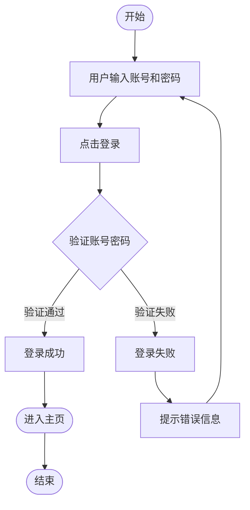

# 用户登录流程图

## 说明

| 节点 | 类型 | 说明 |
| --- | --- | --- |
| 开始 | 起止 | 流程入口 |
| 用户输入账号和密码 | 处理 | 用户填写登录表单 |
| 点击登录 | 处理 | 提交表单 |
| 验证账号密码 | 判断 | 后端校验凭据是否正确 |
| 登录成功 | 处理 | 验证通过分支 |
| 登录失败 | 处理 | 验证失败分支 |
| 提示错误信息 | 处理 | 提示后返回重新输入 |
| 进入主页 / 结束 | 起止 | 成功后跳转并结束流程 |
